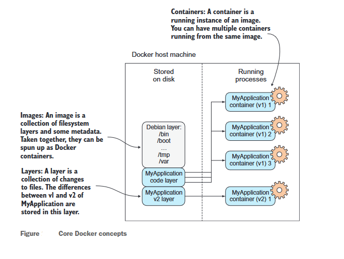
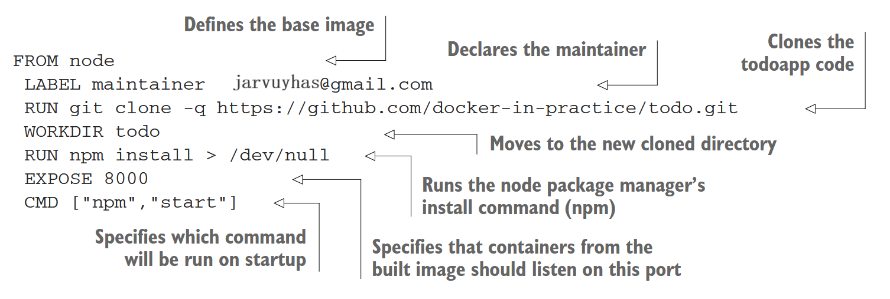
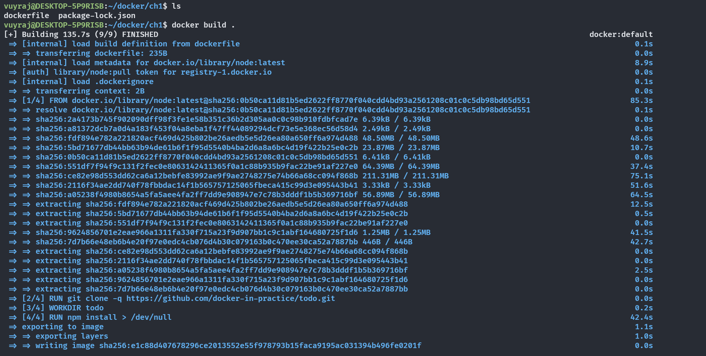
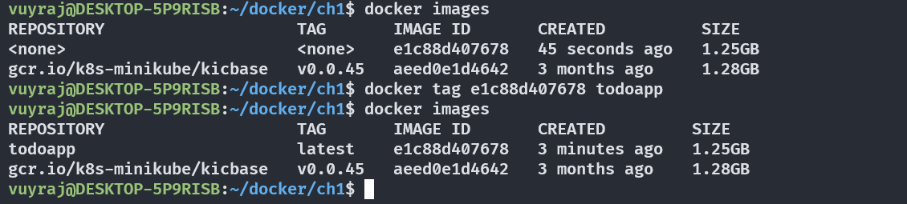
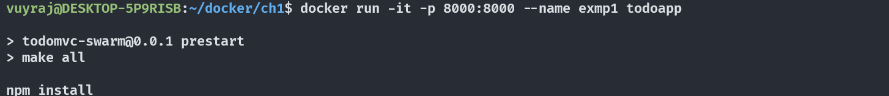
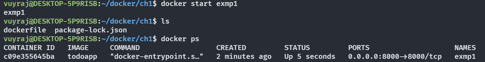
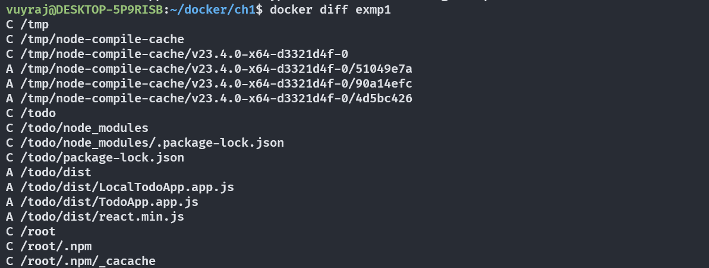

# Docker In Practice

## Docker Fundamental

#### What is Docker
- Docker is an application that allows you to build, test and deploy an application anywhere regardless of platfrom.
- Docker is the underlying technology of containers.
- Docker works on the same philosphy as A container ship is a cargo ship that carries all of its load in truck-size intermodal containers, in a technique called containerization.
- In the same way docker software carries all of the application and its dependencies in a container.  

#### Usage of Docker / Containeriaztion

- For Running lightweight VMs
- For Packaging/Testing/Protyping a software
- For Modelling/Simulating networks
- Enables Continous Delivery

#### Some Basic Concepts

 

A Docker image can be viewed as a program while a container as a process which fully demonstrates the concept "Process are the program in execution."
OR
From object-oriented principles, another way to look at images and containers is to view images as classes and containers as objects. In the same way that objects are concrete instances of classes, containers are instances of images.

### Build a Docker Application

| **Method**                          | **Description**                                                                                                   |
|-------------------------------------|-------------------------------------------------------------------------------------------------------------------|
| Docker commands / “By hand”         | Fire up a container with `docker run` and input the commands to create your image on the command line. Create a new image with `docker commit`. |
| Dockerfile                          | Build from a known base image and specify the build with a limited set of simple commands.                        |
| Dockerfile and CM tool              | Same as Dockerfile, but you hand over control of the build to a more sophisticated Configuration Management (CM) tool. |
| Scratch image and import a set of files | From an empty image, import a TAR file with the required files.                                                  |

#### Writing a Docker File
A docker file is a text file with series of commands in it which defines a docker image.
A Each command creates a image with its unique image id.

The code for the dockerfile:

#### Building a docker image
- Form a dockerfile we can easily build its image.

Each build steps are numbered sequentially.

- We can tag the image ID with a name.
 

- After tagging we can Run the image for container creation.

The docker run subcommand starts the container, -p maps the container’s port 8000 to the port 8000 on the host machine, --name / -n gives the container a unique name, and the last argument is the image.

- we can stop the runnig container by ctrl + C
- For restarting the Container:

- `docker diff ` command gives the differences after the image was initated.

#### Docker Layering

Docker uses Copy-on-Write mechanism to reduce the required disk space amount.
Whenever a running container needs to write to a file, it records the change by copying the item to a new area of disk. When a Docker commit is performed, this new area of disk is frozen and recorded as a layer with its own identifier.
This explains how docker can start containers quickly.

ID can be used to create different images by refrencing the same layers if the new image requires the exact same layer. 
So images can share different layers. To make the container size small we can operate on layers level and remove non required layers and share same layers (make layers sharable as much as possible). 

## Understanding Docker:Inside the engine room

### Docker’s architecture

### Docker registries
