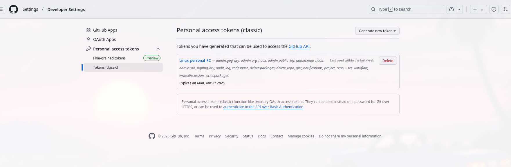

### Git vs Github

- Git is a distributed version control system for tracking differences in the code. The git marks the changes in code and record it with refrence to time so code could be rollbacked.
- Github is a platform that provides services around git. It provides a storage for project (repository) , to simplify distributed nature of git.
- git is maintained by linux foundation while github is owned by microsoft.
- git is open source & github comes at different free and premium pricings.
- git and github both provides collabration functionality for software engineering. Git is complex and github streamlines the collaboration workflow. 

### Version control system

- Version control system is a CASE tool which is used to keep track of each and every modification done to the source code.
- The VCS answers the question of Who, What, When, Why related to the changed code.
	- Local VCS :- It has single repo in the host. There is only one machine.
	- Central VCS :- It has single repo in the server. clients modifies the servers repo.
	- Distributed VCS :- Has multiple repos around client and server.

### Git pull vs Git fetch

- **`GIT PULL = GIT FETCH + GIT MERGE`**

- git fetch updates the local git repo with the remote repo.
- While git pull updates / syncs the local repo and the working directory with refrence to the remote repo.
- while during git pull if merge conflict occurs then then that git pull is equivalent to the fit fetch.

### Creating PAT in Github

- Go to  github account developer setting, then we can create a new personal access token. and assign the scopes.
- 
- after filling it up we get a hash as the PAT which we need to be  copied now only. 

- 

### Connecting Github account with ssh-key

- At first we generate the ssh key in CLI.
- 
- The we go to settings of the github account.
- then select ssh and gpg keys in the left pane of settings.
- At last we add the public ssh key in the  ssh key field.
- After adding our github account is connected with the local pc with ssh.
- 

###  Https vs Ssh

- git clonning with ssh is a secure method and there is no need to enter credentials frequently.
- git clonning with https is a  method where it does not need to ssh keys; and clonnig works immediately with only `git` binary installed.
- git ssh cloning requires the direct access to the server to add ssh keys.
- git https cloning is suitable if we are working behind a firewall or proxy which restricts the ssh.
- Examples:-
-  Clone using the web URL `git clone https://github.com/vuyraj/Learning-Devops.git`
- Uses a password-protected SSH key. `git clone git@github.com:vuyraj/Learning-Devops.git`
-  Work fast with github's CLI. `gh repo clone vuyraj/Learning-Devops`

### Git switch vs checkout

- git switch is an newer sub command in git while git checkout is older one.
- git checkout is complex and works with various things but git switch is only used for branches switching.
- git switch can search for branch in remote repo if not available in local repo but git checkout have no such features
- git switch supports merging of current branch to another branch and then switching to it.

### Git stages
- 

### Some Git commands 

1. `git remote -v` => to check refrences
2. `git log` => to get log of git repo
3. `git diff branch1 branch2` => shows the differences between different branches
4. `git show` =>  information about the latest commit (hash, message, changes, metadatas)
5. git status => Lists changes of files compared to the currently checked-out commit
