### Assignment 1: Git Initialization and Configuration:

•	Initializing a Git repository using git init.

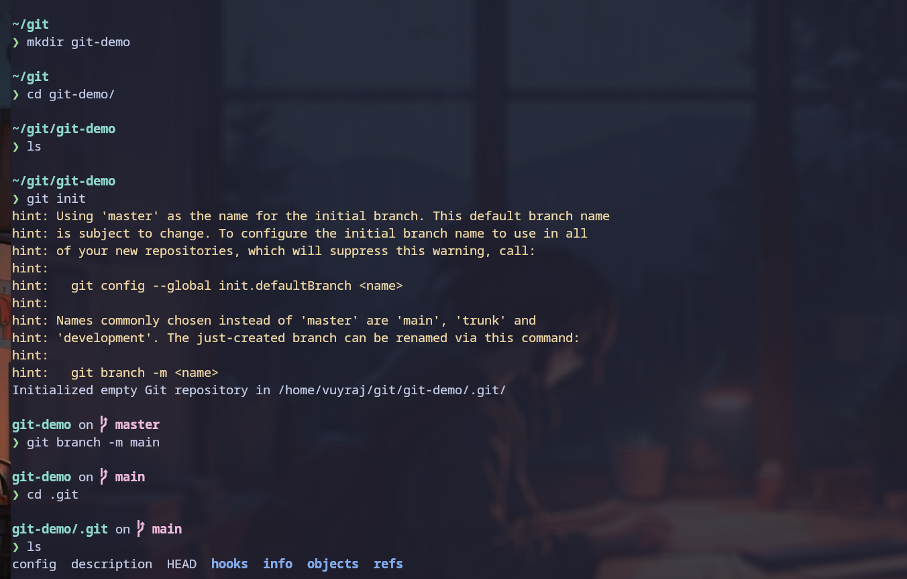

•	Configuring user information with git config.

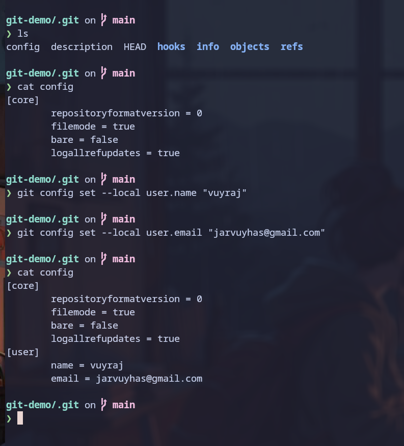

•	Setting up a remote repository using git remote add.
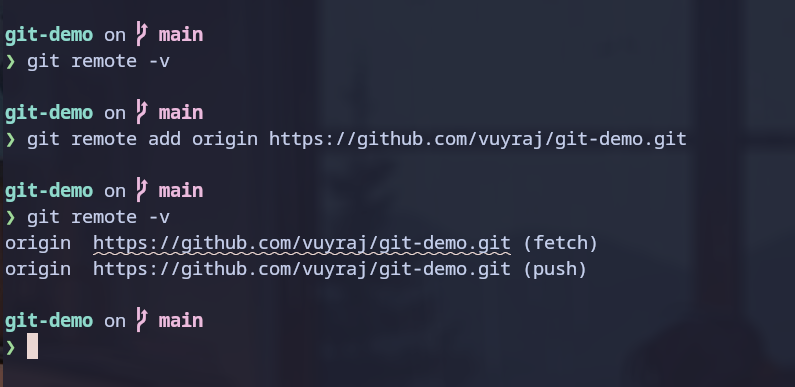
- The `origin` could be said as the short form to refrence the url. 
### Assignment 2: Basic Git Workflow with Fetch:

•	Checking repository status with git status.

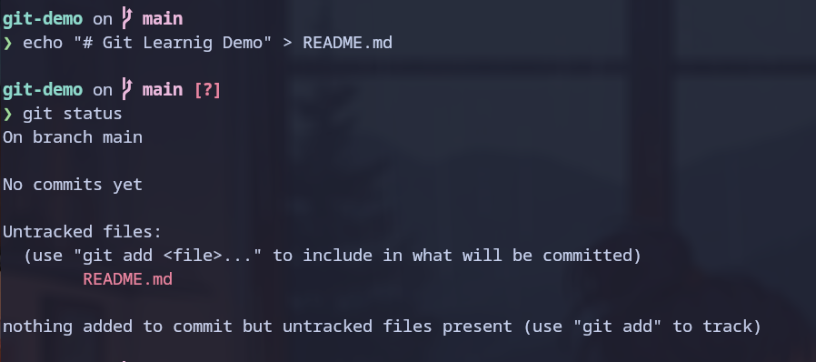

•	Fetching changes from a remote repository using git fetch.

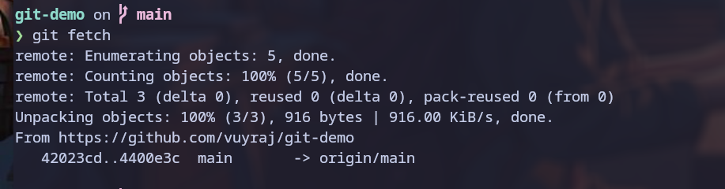

•	Staging changes with git add.

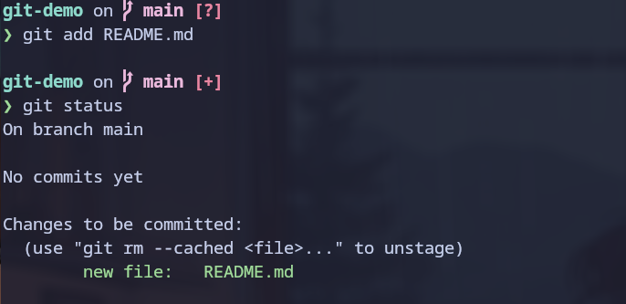

•	Committing changes with git commit.

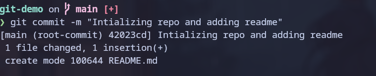

•	Pushing changes to a remote repository using git push.

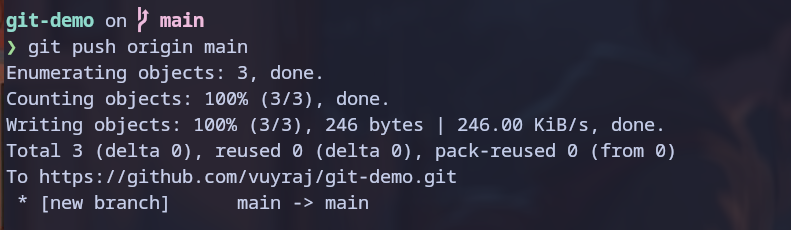

### Assignment 3: Branching:

•	Creating branches with git branch.

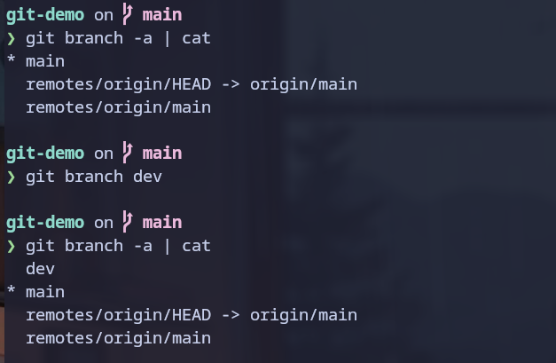

•	Switching branches with git checkout.

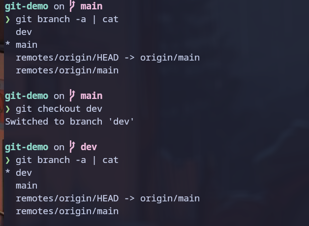

•	Deleting branches with git branch -d.

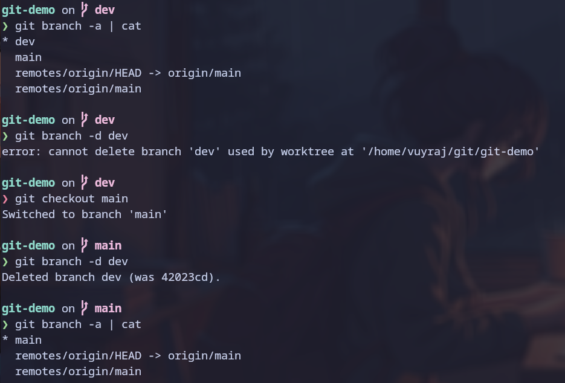

### Assignment 4: Pull Requests and Merging:

•	Creating and reviewing pull requests on GitHub.

- At first create a new branch/fork and push the code to github.
- Then got to pull request section and create a pull request.
- 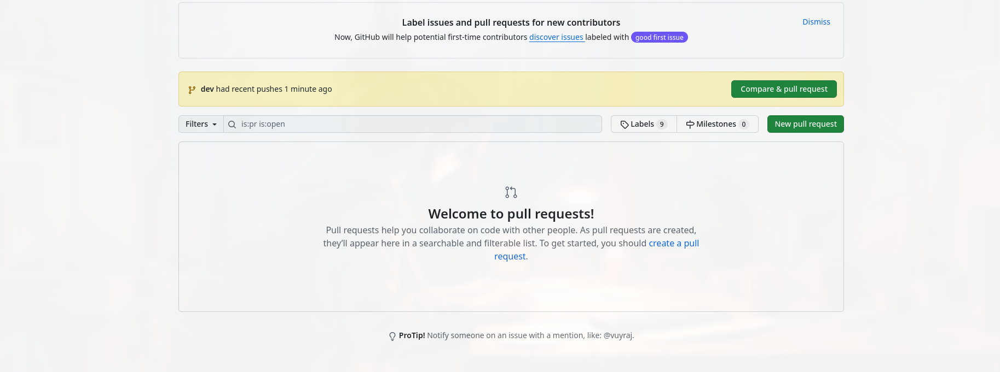
- 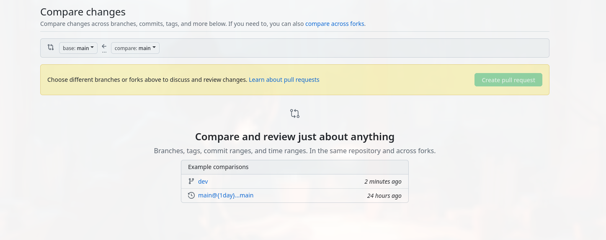
- 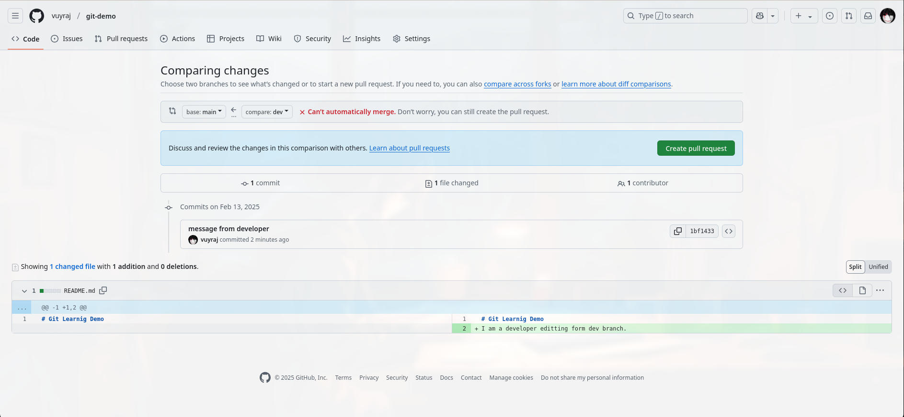
- 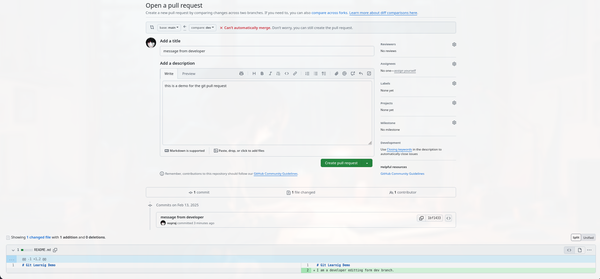
- Open the pull request. github checks if the code could be merged directly , if not it prompts for the conflicts.
- 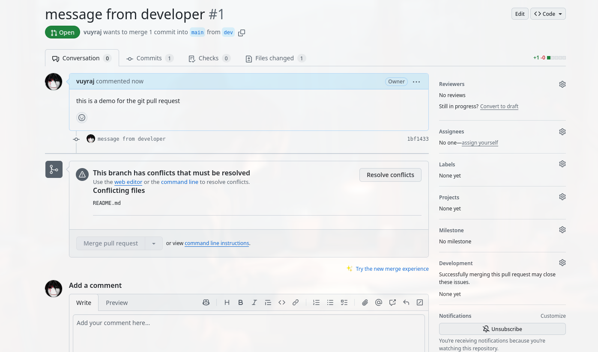
- 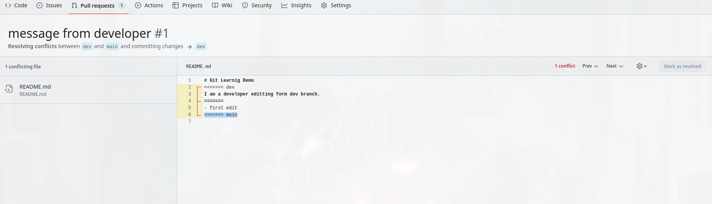
- 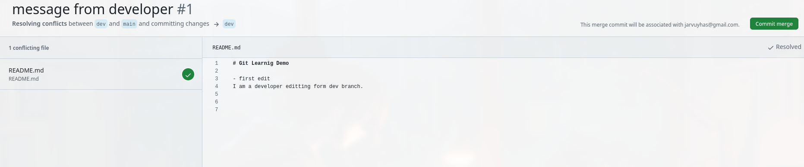
- Resolve the conflicts and commit the changes.
- 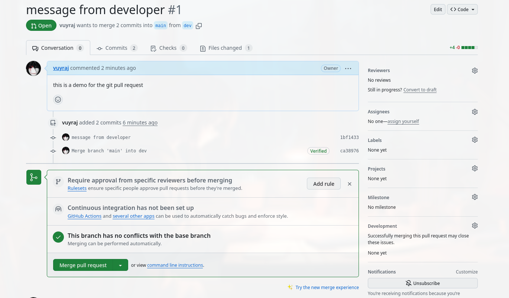
- At last merge the pull request to main branch.
- 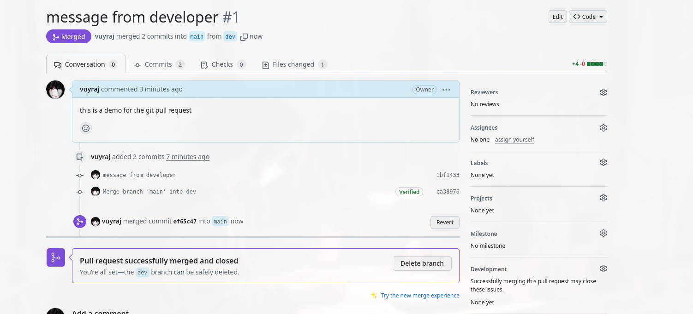
- 