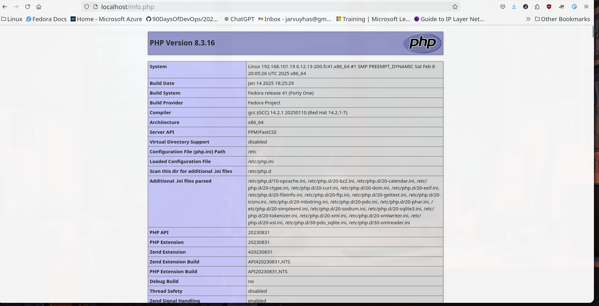
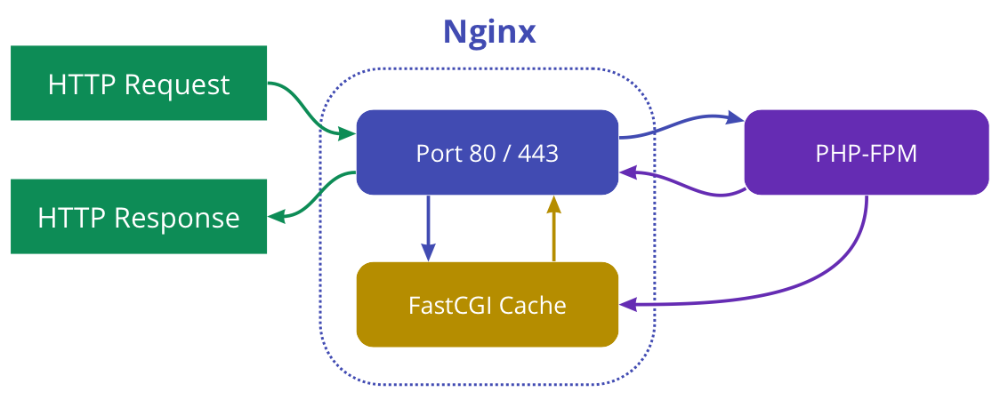

#### Install LEMP stack (avoid installing mysql) and open page that displays php info on port 80.

### LEMP
- LEMP stack is a group of softwares used for hosting dynamic web sites.
- L (Linux)   => Operating System
- E (engineX)  => Web server  
- M (Mysql)  =>  Database for storing backend data
- p (PHP)  => Programing Language for handling dynamic processing.

- We can install the nginx and webserver, the install php by `dnf install php`, it could be install modularly by just installing php-fpm.
- Some of the files will be auto generated like 
-  php-fpm.conf 
```conf 
#PHP-FPM FastCGI server
#network or unix domain socket configuration

upstream php-fpm {
        server unix:/run/php-fpm/www.sock;
}
```
-  php.conf 
```conf
# pass the PHP scripts to FastCGI server
#
# See conf.d/php-fpm.conf for socket configuration
#
index index.php index.html index.htm;

location ~ \.(php|phar)(/.*)?$ {
    fastcgi_split_path_info ^(.+\.(?:php|phar))(/.*)$;

    fastcgi_intercept_errors on;
    fastcgi_index  index.php;
    include        fastcgi_params;
    fastcgi_param  SCRIPT_FILENAME  $document_root$fastcgi_script_name;
    fastcgi_param  PATH_INFO $fastcgi_path_info;
    fastcgi_pass   php-fpm;
}
```


- then create a php page in `/usr/share/nginx/html` for producing php iinformation
```bash
echo '<?php phpinfo(); ?>' | sudo tee /usr/share/nginx/html/info.php
```

- At last we can visit he website at localhost/info.php




- Process


- **Clinet** sends http requests to the nginx server .
- **Nginx** forwards PHP requests to PHP-FPM.  
- **PHP-FPM** assigns a worker process to handle the request.  
- **The PHP script executes**, returning the result to Nginx.  
-  **Nginx delivers the response** to the client.

### php-fpm

- PHP-FPM works as a process manager, managing PHP processes and handling PHP requests separately from the web server.
- configuration file `/etc/php-fpm.d/www.conf`
```
[www]
user = nginx
group = nginx

listen = /run/php-fpm/www.sock

#pools configuration
pm = dynamic
pm.max_children = 10
pm.start_servers = 3
pm.min_spare_servers = 2
pm.max_spare_servers = 5
```

