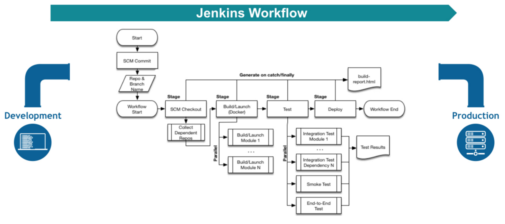
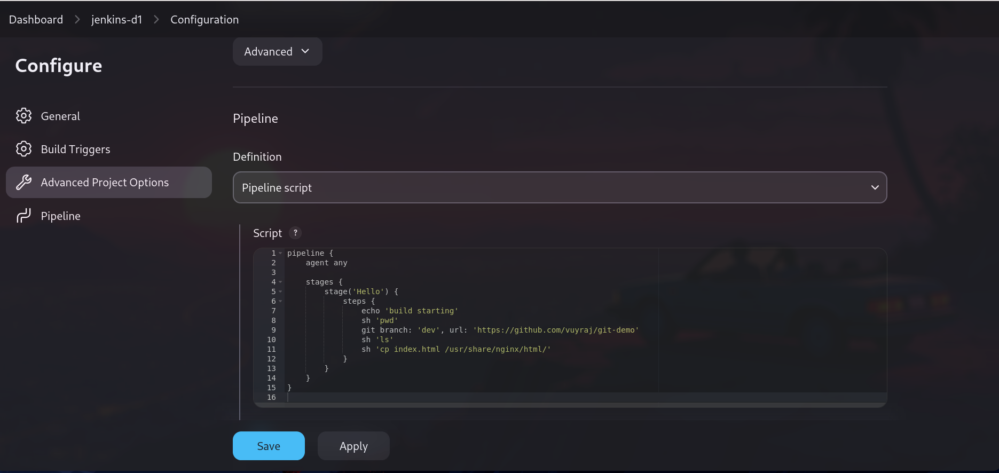
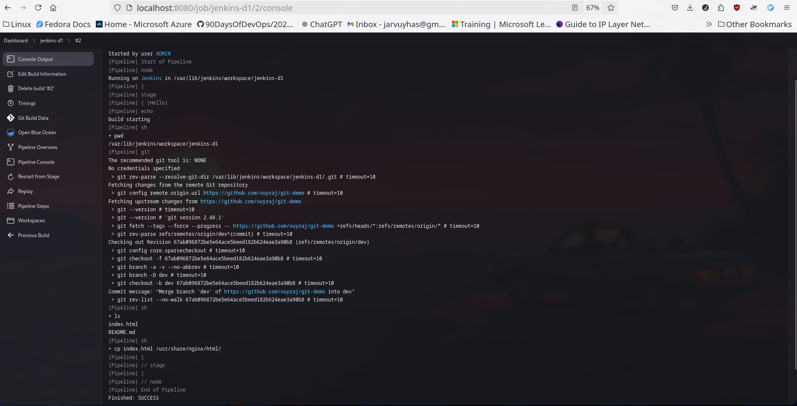
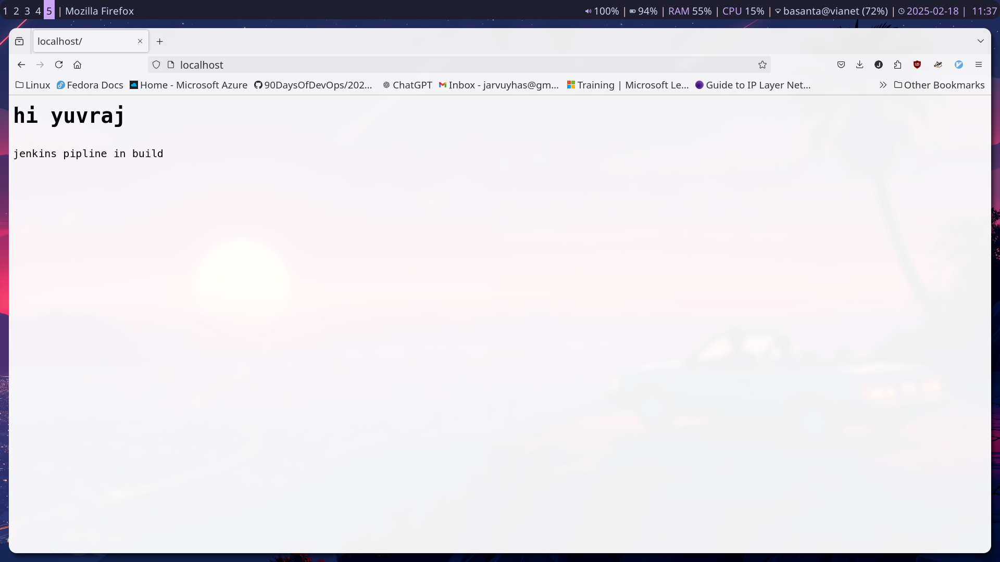
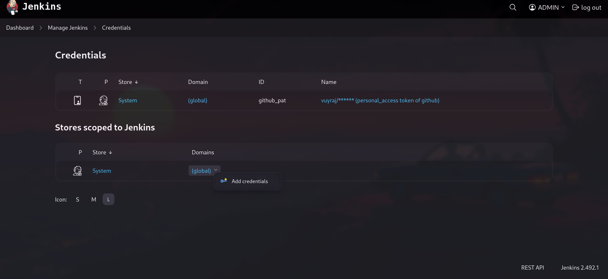
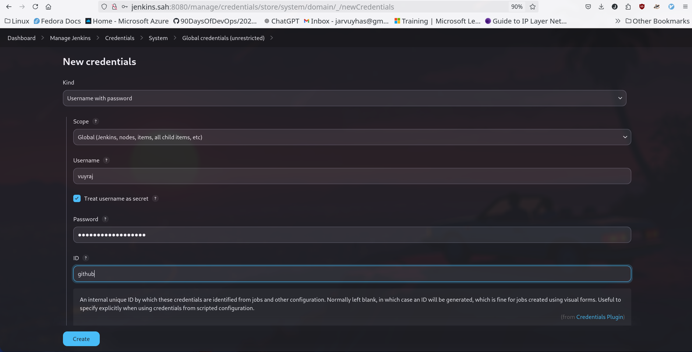

### Jenkins

- Jenkins is a CI/CD software used to automate the software development process.
- A jenkins pipeline is a expressway of events and tasks interconnected in sequence where each step of software build and delivery could be expressed in code for the for fast and efficient software delivery.



- We can configure the pipeline in declarative or scripted way.
- we can define stages in pipeline as a subset of tasks.
- A step is a single task.



- During the build process it generate its output in the console. If any error will occur it will show here.

- The below is the result of copying a index file from a github repository to the nginx default page. It gives a perfect example of automated delivery.
- If we want we can just run the pipeline if there is change in code.



### declarative vs scripted pipeline

- Scripted pipeline is the older, original way of defining pipelines as a code. While Declarative is newer one and esaier one.
- Scripted uses Groovy scripting language and declarative also uses groovy but in as structures and predefined format.
- Scripted one is more flexible ones.
- Scripted pipeline is complex and alllows for granular error handling, code reuse and modularity and are difficult to read. While Declative pipeline is made with the focus of ease of use and does provides only some basic functionality.
- Example of Scripted pipeline.
```
node {  
    stage('Build') {  
        // Build the application  
        sh 'mvn clean install'  
    }  
    stage('Test') {  
        // Run the tests  
        sh 'mvn test'  
    }  
    stage('Deploy') {  
        // Deploy the application  
        sh 'deploy.sh'  
    }  
}
```

- Example of Declarative Pipeline.
```
pipeline {  
    agent any  
    stages {  
        stage('Build') {  
            steps {  
                // Build the application  
                sh 'mvn clean install'  
            }  
        }  
        stage('Test') {  
            steps {  
                // Run the tests  
                sh 'mvn test'  
            }  
        }  
        stage('Deploy') {  
            steps {  
                // Deploy the application  
                sh 'deploy.sh'  
            }  
        }  
    }  
}

```


### credentials configuration

- Credentials ensures the users credentials remain secure and private as jenkins controller encrypts the credentials and the pipelines could use the id of the configured credentials to access the keys.
- Jnkins can store credential of formats like :- secret key, username and password, secret file, SSH username with private key and Certificate.





