### Parameters

- Parameters is used to get dynamic values from the user at the runtime.
- Parameters could be accessed by `params.VARIABLE` or `"${VARIABLE}"` .
- types of parameters allowed in jenkins are :-
	1. Boolean
	2. Strings
	3. Choice
	4. Password
	5. Credentials
	6. Multi-line Strings
	7. Run

##### Example parameters  defined via Jenkins UI

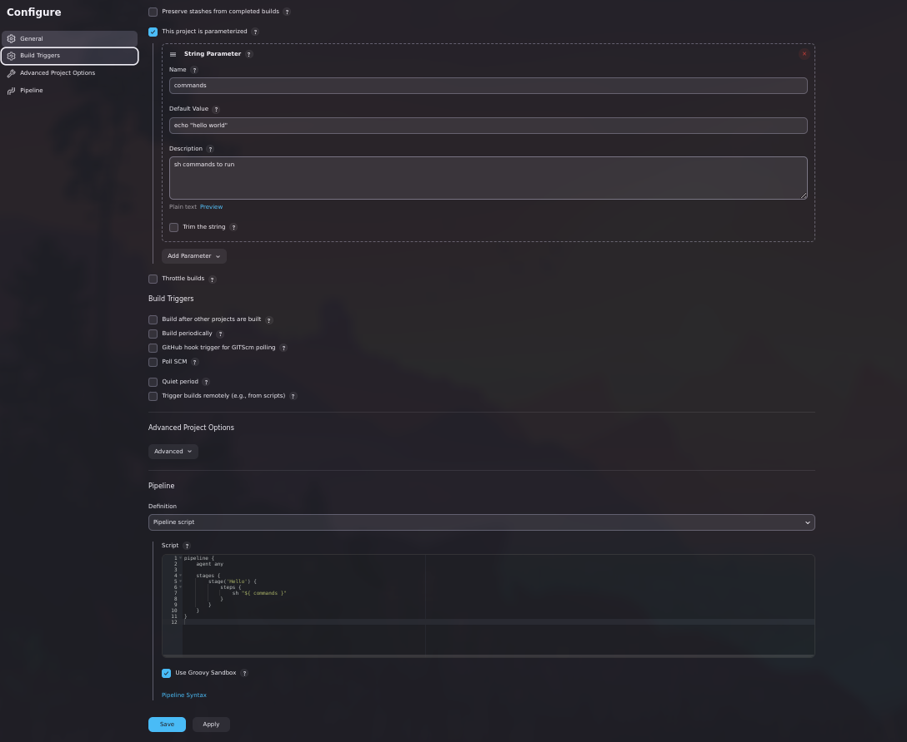

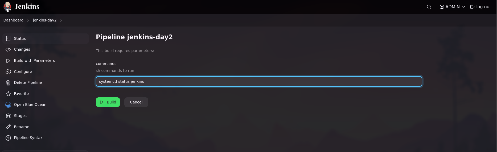

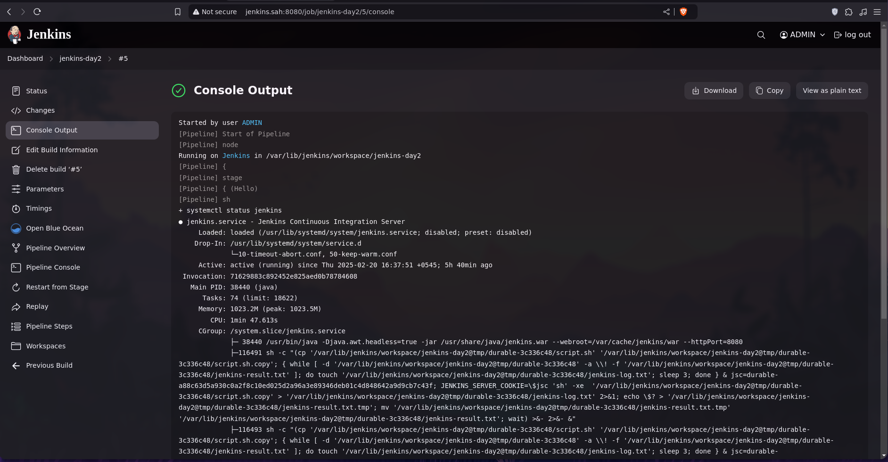


##### Example parameters  defined via groovy script

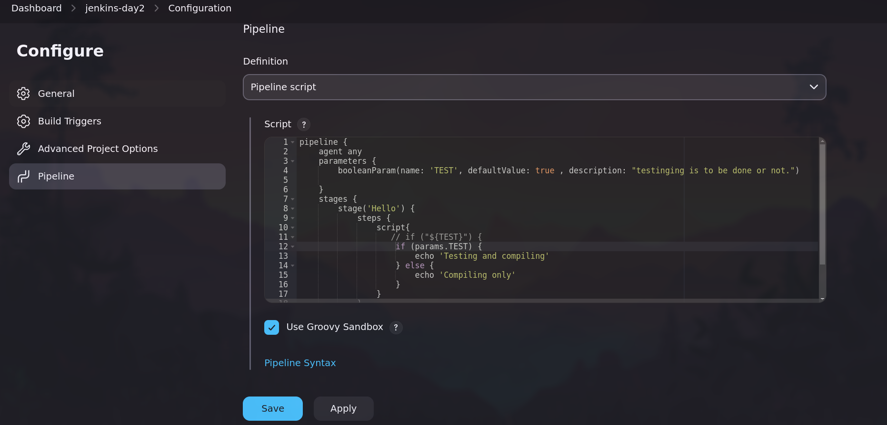

- **Note :**    `${Test}` is converted to string which always evaluates to true if non empty.

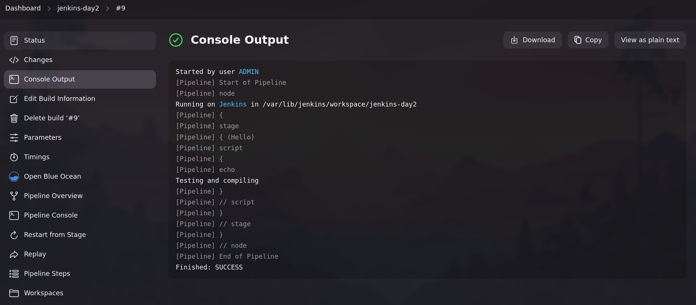


### Poll SCM

- POLL SCM(Source Code Mangement) checks the codes source (github) at fixed interval for any change. If there is change then the build is triggered.
- It is an expensive operation as it checks for change in entire workspace, so webhook trigger is recommended.

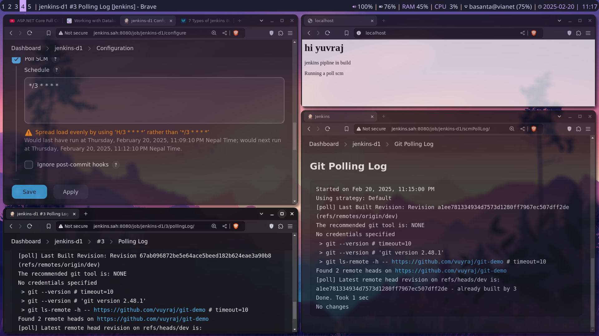

- **Note :**    H stands for hash. (it may give random value in range if machines are busy). It is recommended to use H wherever possible to better utilize resources.
- we can also use `H(5-10)/2` means every 2 steps in interval of 5 to 10. 
- TZ=Asia/Kathmandu for timezone specification.

### Webhook Trigger

- Webhook trigger is an event-driven method where push notification is sent towards the client if certain event triggers at the server.
- When a cetain event occur then the github will send a POST request notifying the trigger to the specified URL.

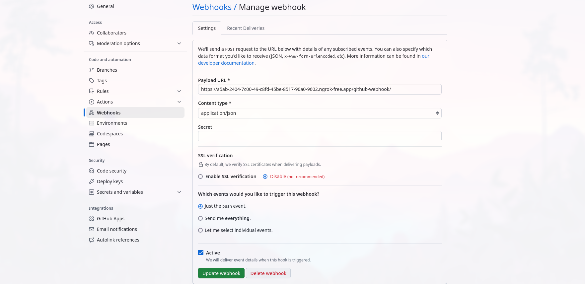

- Due to our server being in localhost we use ngrok to make it publically available so that github could communicate.
- We need to specify in jenkins pipeline about `GitHub hook trigger for GITScm polling`.

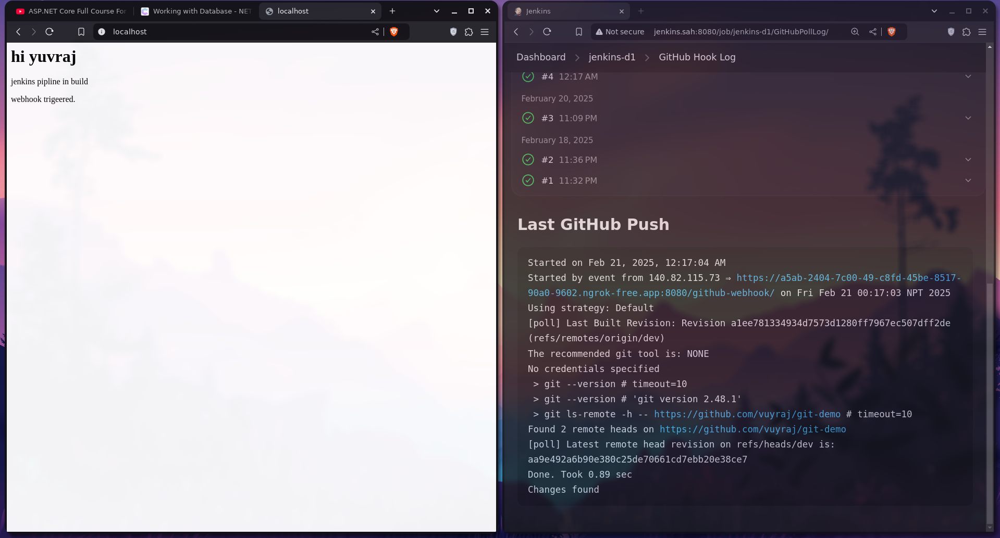

### Nginx as reverse Proxy

-  Nginx can be used for reverse proxy for jenkins so that we can implement SSL and other nginx features to make our jenkins site safe.


-  we can use minimal configuration file:-
```
server {

  listen  443 ssl;
  
  server_name jenkins.sah ;

  ssl_certificate /etc/ssl/yuv.sah/yuv.sah.crt;
  ssl_certificate_key /etc/ssl/yuv.sah/yuv.sah.key;
  
  root            /var/cache/jenkins/war/;

  access_log      /var/log/nginx/jenkins.access.log;
  error_log       /var/log/nginx/jenkins.error.log;
  location / {
      proxy_pass   http://localhost:8080;
 	}
}		
```

- the following conf is needed to configure the proxy:- (**It is based on official website at jenkins.**)
```conf 
upstream jenkins {
  keepalive 32; 
  server 127.0.0.1:8080; 
}

server {
  listen  443 ssl;
  
  server_name jenkins.sah ;

  ssl_certificate /etc/ssl/yuv.sah/yuv.sah.crt;
  ssl_certificate_key /etc/ssl/yuv.sah/yuv.sah.key;
  
  # this is the jenkins web root directory
  # (mentioned in the output of "systemctl cat jenkins")
  root            /var/cache/jenkins/war/;

  access_log      /var/log/nginx/jenkins.access.log;
  error_log       /var/log/nginx/jenkins.error.log;

  # pass through headers from Jenkins that Nginx considers invalid
  ignore_invalid_headers off;

  location ~ "^/static/[0-9a-fA-F]{8}\/(.*)$" {
    # rewrite all static files into requests to the root
    # E.g /static/12345678/css/something.css will become /css/something.css
    rewrite "^/static/[0-9a-fA-F]{8}\/(.*)" /$1 last;
  }

  location /userContent {
    # have nginx handle all the static requests to userContent folder
    # note : This is the $JENKINS_HOME dir
    root /var/lib/jenkins/;
    if (!-f $request_filename){
      # this file does not exist, might be a directory or a /**view** url
      rewrite (.*) /$1 last;
      break;
    }
    sendfile on;
  }

  location / {
      sendfile off;
      proxy_pass         http://jenkins;
      proxy_redirect     default;
      proxy_http_version 1.1;

      # Required for Jenkins websocket agents
      proxy_set_header   Connection        $connection_upgrade;
      proxy_set_header   Upgrade           $http_upgrade;

      proxy_set_header   Host              $http_host;
      proxy_set_header   X-Real-IP         $remote_addr;
      proxy_set_header   X-Forwarded-For   $proxy_add_x_forwarded_for;
      proxy_set_header   X-Forwarded-Proto $scheme;
      proxy_max_temp_file_size 0;

      #this is the maximum upload size
      client_max_body_size       10m;
      client_body_buffer_size    128k;

      proxy_connect_timeout      90;
      proxy_send_timeout         90;
      proxy_read_timeout         90;
      proxy_request_buffering    off; # Required for HTTP CLI commands
  }

}
# Required for Jenkins websocket agents
map $http_upgrade $connection_upgrade {
  default upgrade;
  '' close;
}


```


- and the we have to adjust the jenkins url as well at the jenkins system settings.

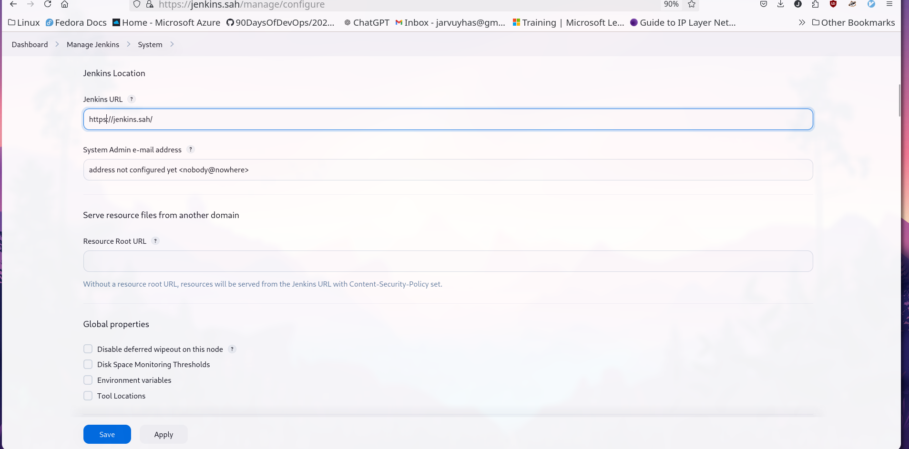

### Credentials

- We can use credentials in jenkins to masking or encrypting the users credentials(password/ sensitive information) so that  credentials remain safe and secure.
- The following image shows jenkins UI as how we can add the credentials.

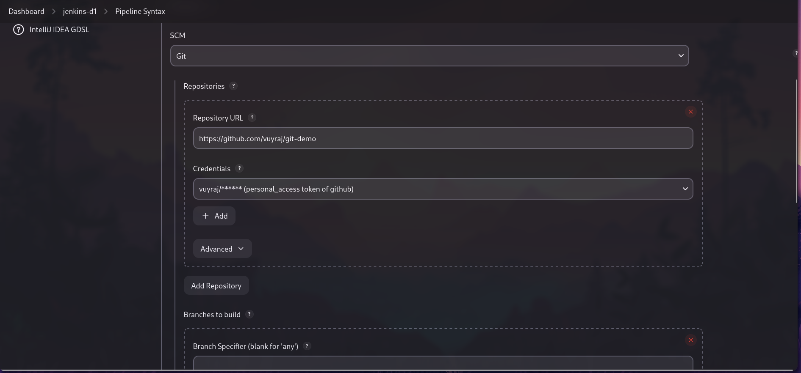

- The following groovy script uses the credential id
`checkout scmGit(branches: [[name: '*/dev']], extensions: [], userRemoteConfigs: [[credentialsId: 'github_pat', url: 'https://github.com/vuyraj/git-demo']])`


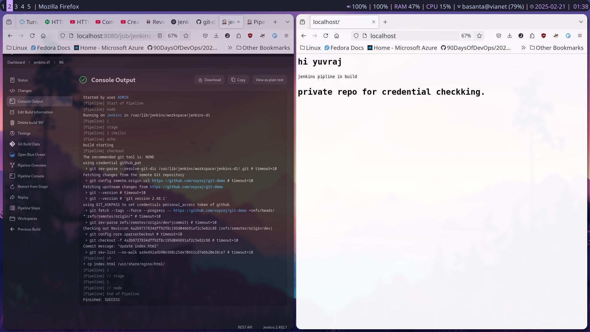