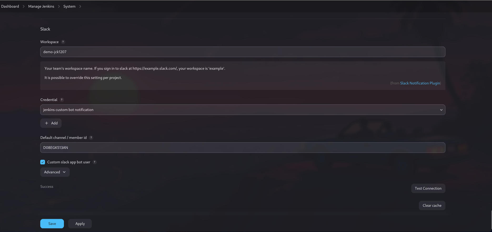

###  Create a jenkins pipeline that runs a script from your jenkins machine

- Jenkins can run the script in the local machine as well, so that we don't have to configure the local machine/ Agent using the configuration management tool like ansible, puppet,chef.

- the following shows an jenkins pipeline job running a bash script from the local machine.


- the following shows an jenkins freestyle job running a bash script from the local machine.


### Create a jenkins pipeline that sends build notification to a 3rd party service (slack, discord, whatsapp or google chat)

- Jenkins provides a functionality to send notifications via the jenkins plugins.
- Thes notification can be used for prebuild and post build notify according to the need.

- Jenkins plugins like extended email and  email notification,fo emails, slack-notify for slack notifiaction ,etc.

- The following image show how we can configure a slack notification. We have created a slack bot which will recieve notification from jenkins and release it to the channel.
- We can also use the prebuilt jenkins app in the slack.




- here we have configured an email for notification.


- Now for utilization in post build:-
```groovy
pipeline {
    agent any

    stages {
        stage('run') {
            steps {
                sh 'bash /home/vuyraj/temp/sche.sh'
          
            }
        }
          stage('test') {
            steps {
                sh 'cat /home/vuyraj/temp/sche.sh'
                sh 'cat /home/vuyraj/temp/time.txt'
            }
        }
    }
    
    post {
        failure {
              mail to: 'jarvuyhas@gmail.com',
                subject: "FAILED: Build ${env.JOB_NAME}", 
                body: "Build failed ${env.JOB_NAME} build no: ${env.BUILD_NUMBER}.\n\nView the log at:\n ${env.BUILD_URL}\n\nBlue Ocean:\n${env.RUN_DISPLAY_URL}"
        }
    
    success{
            mail to: 'jarvuyhas@gmail.com',
                subject: "SUCCESSFUL: Build ${env.JOB_NAME}", 
                body: "Build Successful ${env.JOB_NAME} build no: ${env.BUILD_NUMBER}\n\nView the log at:\n ${env.BUILD_URL}\n\nBlue Ocean:\n${env.RUN_DISPLAY_URL}"
        }
        
        aborted{
            mail to: 'jarvuyhas@gmail.com',
                subject: "ABORTED: Build ${env.JOB_NAME}", 
                body: "Build was aborted ${env.JOB_NAME} build no: ${env.BUILD_NUMBER}\n\nView the log at:\n ${env.BUILD_URL}\n\nBlue Ocean:\n${env.RUN_DISPLAY_URL}"
        }
    }
}

```

- Its Output is :- 


