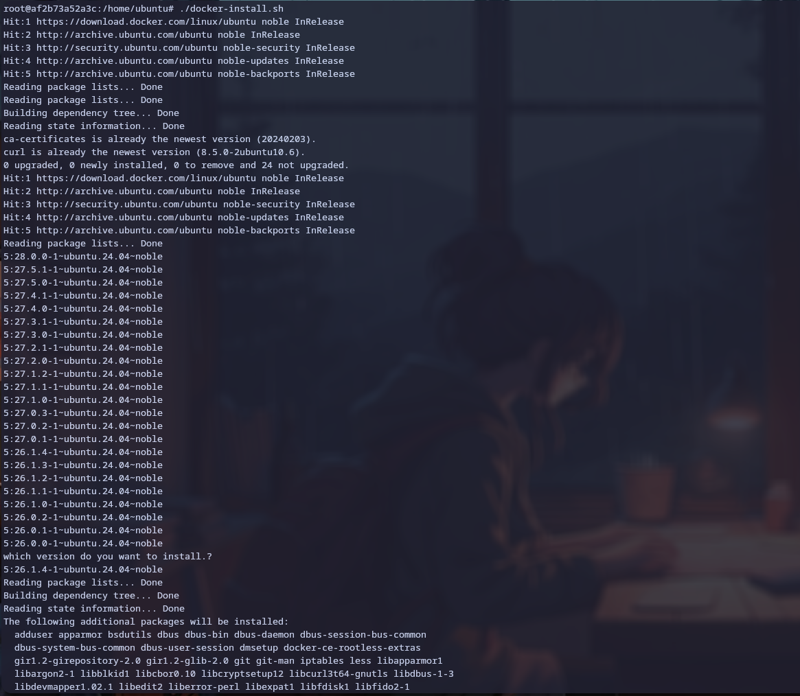
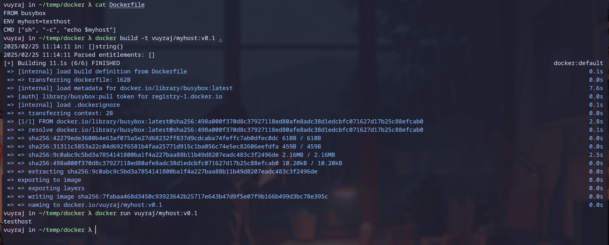
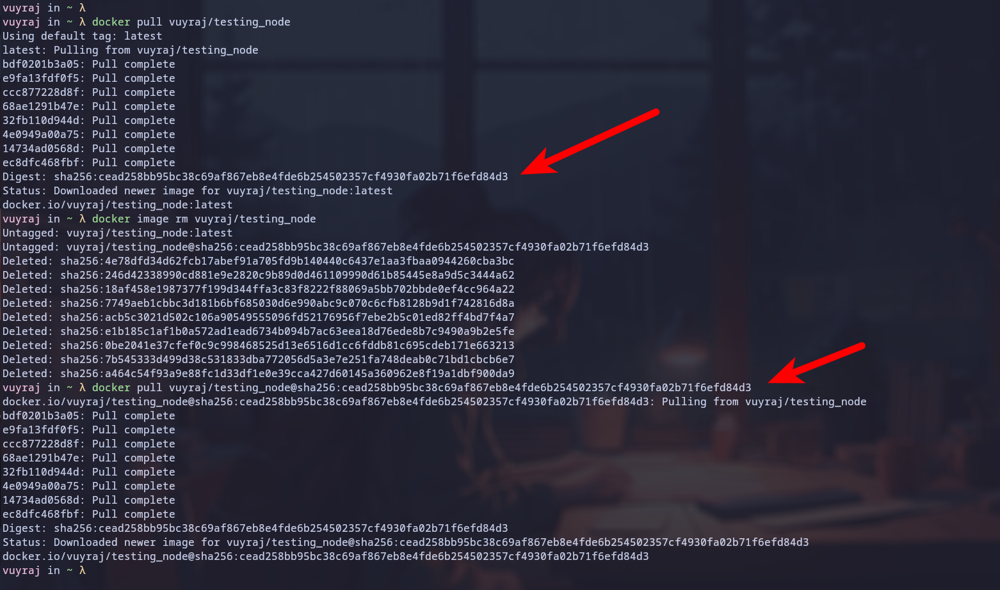

### Docker Installation 

### for ubuntu
1. First of all update your package manager's list . `apt-get update`
2. If there is no `ca-certificates` and  `curl` then install it.
3. Then create a directory at `/etc/apt/keyrings` with a file permission of 0755; which will be used to store the docker gpg key.
4. then dowbload the gpg key and store it at the directory. `curl -fsSL https://download.docker.com/linux/ubuntu/gpg -o /etc/apt/keyrings/docker.asc`
5. Make sure the file is readable by all `a+g` so that it is readable by apt.
6. Then we need to add the docker repository to our apt package sources , so that apt could find the source form where apt can download the docker.
	- `/etc/apt/sources.list.d/docker.list` here the docker.list contains something like `deb [arch=amd64 signed-by=/etc/apt/keyrings/docker.asc] https://download.docker.com/linux/ubuntu   noble stable` 
	- apt could use the above url to fetch the packages and verify it by gpg key `docker.asc` and the docker.list file also specidies the architecture of the computer.
	- 
7. At last we can install the docker-ce, docker- cli ,docker compose => `apt-get install docker-ce docker-ce-cli docker-compose-plugin`
8. If we need we can also test if it is running or not by `sudo service docker start`  and  `sudo docker run hello-world `. which should give hello world output.


### for fedora

1. At first update the dnf package list by `dnf update`
2. Then install `dnf-plugins-core` which will provide the commands to manage DNF repositories.
3.  Then we can add the repository source ` sudo dnf config-manager --add-repo https://download.docker.com/linux/fedora/docker-ce.repo`
4. At last we can install the docker-ce, docker- cli ,docker compose => ` sudo dnf install docker-ce docker-ce-cli docker-compose-plugin`
5. If we need we can also test if it is running or not by `sudo  systemctl enable --now docker`  and  `sudo docker run hello-world `. which should give hello world output. ` 

**Note: For RHEL and Centos almost same just change the name of os in url.**


### script

```bash
#!/bin/bash

#select os
. /etc/os-release

 case $ID in


ubuntu)
	# Add Docker's official GPG key:
	sudo apt-get update
	sudo apt-get install -y ca-certificates curl
	sudo install -m 0755 -d /etc/apt/keyrings
	sudo curl -fsSL https://download.docker.com/linux/ubuntu/gpg -o /etc/apt/keyrings/docker.asc
	sudo chmod a+r /etc/apt/keyrings/docker.asc

	# Add the repository to Apt sources:
	echo \
	  "deb [arch=$(dpkg --print-architecture) signed-by=/etc/apt/keyrings/docker.asc] https://download.docker.com/linux/ubuntu \
	  $(. /etc/os-release && echo "${UBUNTU_CODENAME:-$VERSION_CODENAME}") stable" | \
	  sudo  tee /etc/apt/sources.list.d/docker.list > /dev/null

    sudo apt-get update


	# Docker installation

	sudo apt-cache madison docker-ce | awk '{ print $3 }'

	echo "which version do you want to install.?"
	read -r DOCKER_VERSION

	sudo apt-get install -y docker-ce="$DOCKER_VERSION" docker-ce-cli="$DOCKER_VERSION" containerd.io docker-buildx-plugin docker-compose-plugin

	;;

fedora)
	sudo dnf -y install dnf-plugins-core
	sudo dnf-3 config-manager --add-repo https://download.docker.com/linux/fedora/docker-ce.repo

	dnf list docker-ce --showduplicates | sort -r
	
	echo "which version of CE do you want to install.?"
	read -r DOCKER_VERSION

	dnf list docker-ce-cli --showduplicates | sort -r
	
	echo "which version of CLI do you want to install.?"
	read -r DOCKER_CLI_VERSION

	sudo dnf install -y docker-ce-"$DOCKER_VERSION" docker-ce-cli-"$DOCKER_CLI_VERSION" containerd.io docker-buildx-plugin docker-compose-plugin
		
	sudo systemctl enable --now docker

	;;

centos)
	sudo dnf -y install dnf-plugins-core
	sudo dnf config-manager --add-repo https://download.docker.com/linux/centos/docker-ce.repo
	
	dnf list docker-ce --showduplicates | sort -r
	
	echo "which version of CE do you want to install.?"
	read -r DOCKER_VERSION

	dnf list docker-ce-cli --showduplicates | sort -r
		
	echo "which version of CLI do you want to install.?"
	read -r DOCKER_CLI_VERSION

	sudo dnf install -y docker-ce-"$DOCKER_VERSION" docker-ce-cli-"$DOCKER_CLI_VERSION" containerd.io docker-buildx-plugin docker-compose-plugin
		
	sudo systemctl enable --now docker

	;;


rhel)
	sudo dnf -y install dnf-plugins-core
	sudo dnf config-manager --add-repo https://download.docker.com/linux/rhel/docker-ce.repo

	dnf list docker-ce --showduplicates | sort -r
	
	echo "which version of CE do you want to install.?"
	read -r DOCKER_VERSION

	dnf list docker-ce-cli --showduplicates | sort -r
		
	echo "which version of CLI do you want to install.?"
	read -r DOCKER_CLI_VERSION

	sudo dnf install -y docker-ce-"$DOCKER_VERSION" docker-ce-cli-"$DOCKER_CLI_VERSION" containerd.io docker-buildx-plugin docker-compose-plugin
		
	sudo systemctl enable --now docker

	;;


 *)
 	echo "Unsupported OS: $ID"
          exit 1
    ;; 

 esac

 docker --version
 echo "Docker installed successfully!"


```




### Docker File vs Image vs Container
- Docker File is a  code which has instructions about how to create an image.(R/W)
- Docker Image is a file which is used to create a container.(Read only)
- Docker container is a runtime environment for a software which has all the necessary components needed to run it in isolated environment.(Read only till the image layer at the container layer R/W)

- By analogy : Docker file is like a source code which helps to build a program /software which is docker image and then when we run a instance of the program (docker image) it becames container i.e process.
- DockerFile  ->    Image        ->     Container
- Code           ->    Program    ->    Process

### Container Vs Service

- Docker container is smallest unit of the entire containerization strategy (docker architecture). Docker container is a running instance of an image which does a specific task.
- Docker service is  an collection of containers of a single image ; typically in a distributed system which ensures availability and scalability.
- Docker container is an single running instance of an image and when the container crashes it does not restart / should be manually stopped or started.
- Docker service manages multiple containers and can automatically start and stop a container.

### Docker build
Docker Build command is used to create a image from the DockerFile.
- `--build-arg`  =>  to set build-time variable
- `-f` => to specify the Docker file
- `-t` => to specify the tag of the image
- `--platform` => for specific platform
- `-o` => for specifying output type and path.


### Docker pull

Docker pull command also `docker image pull` is an command used to download container images form the registry.
- `docker pull image:tag`
-  `docker pull --platform linux/amd64 image:tag`  - to download for a specific platforom
- `docker pull --all-tags image` - to download a specfic images with all its tags
- ` docker image pull myregistry.com/testing/test-image` - from spefic registry
- We can also use digest for downloading specific image.
