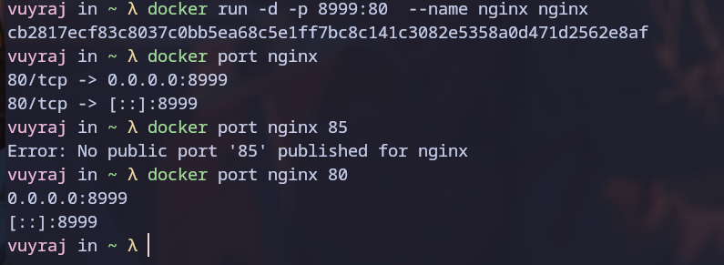
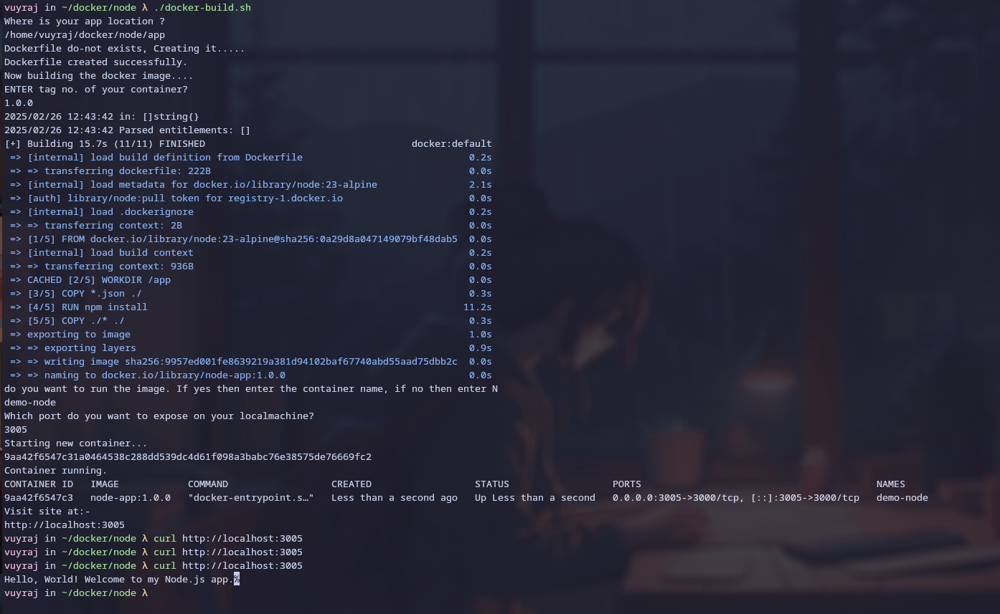
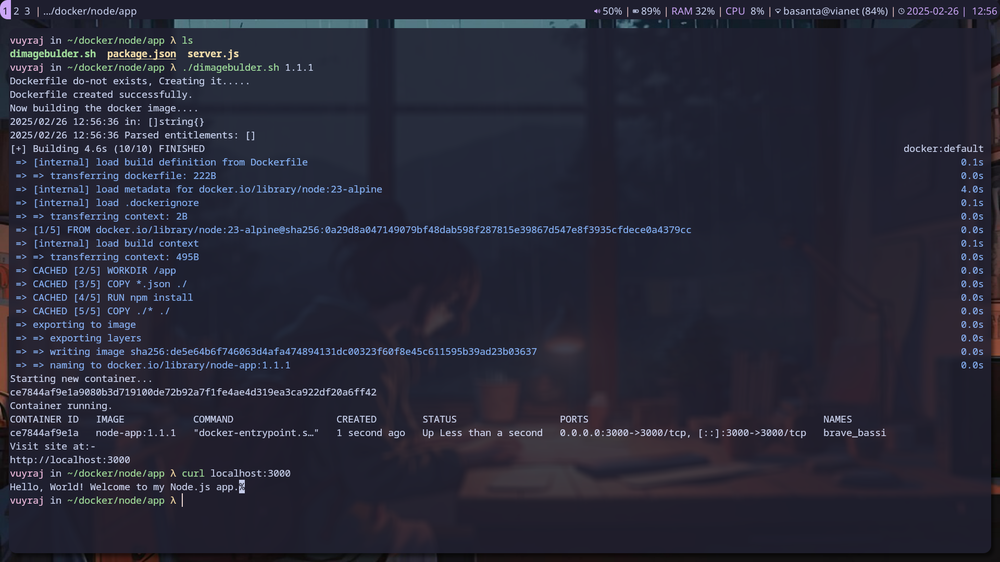

### Port Mapping

- The Port Mapping is the process of mapping of host port to the container's port for external network access. 
- `docker run -p [HOST_PORT]:[CONTAINER_PORT] [IMAGE]`
- here `-p` command is `--publish` command which maps/links a exposed container port to a host port.
- to check which port container is  using we can run command `docker port CONTAINER_NAME CONTAINER_PORT` or `docker inspect`



### Docker Mount

- Docker mounting is a process of attaching a storage to the container so that data could persist even when container goes down.
- Docker provides various mounting strategy like :-

	- Volume mounts :- A Docker-managed storage solution where data is stored and cannot be accessed by non docker processes.
	- Bind mounts :- A bind mount attaches a specific file or directory from the host machine to a container.
	- tmpfs mounts :- A `tmpfs` mount stores data in the container’s memory instead of writing it to disk so that sensitive data is not written anywhere and is persisted.
	- Named pipes :- Named Pipes can be used to establish a communication channel between container and host's docker engine.
- ` docker run --mount type=bind|volume,src=<host-path>,dst=<container-path>` is prefered for volume mount or Bind mount.
- ` docker run --tmpfs <mount-path>[:opts]` is for temporary mounts.


### Bind Mount Vs Volume Mount

 
| Bind Mount                                                                                               | Volume Mount                                                                                                                                     |
| -------------------------------------------------------------------------------------------------------- | ------------------------------------------------------------------------------------------------------------------------------------------------ |
| Bind Mount links the  host's file/directory to the container.                                            | Volume Mount ilinks the docker manged Volume; i.e. specific section of host file system, usually  at `/var/lib/docker/volumes` to the container. |
| The filessystem can be modified by both docker cli and host cli (docker process and non-docker process). | The filesystem can be modified from docker cli only(docker-process)                                                                              |
| From the docker cli; it is possible to modify host files.                                                | The data stored is safe and maintains security integrity and can also use different encryption to store data.                                    |
| They are rarely used.                                                                                    | They are typically used and it is recommended to use them as well.                                                                               |
| Bind mounts are directly referenced and changes can reflected immediately.                               | Docker volume can easily created by `docker volume create` command and can be easily referenced as well.                                         |


###  Dockerfile :- Run and  CMD and  EntryPoint

- Dockerfile Run  is used to execute a command during build stage and creates the image layer.
- Dockerfile CMD   is used to execute a command when the container starts. And the docker CMD command could be overwritten with `docker run image command` when running a container.
- Dockerfile Entrypoint is used  to execute a command when the container starts. And the docker CMD command could not be overwritten by default. It is used for forcing a specific behavior.


### Script for Docker Build

```bash

#!/bin/bash

IMAGE_NAME="node-app"
CONTAINER_PORT=3000

echo "Where is your app location ?"
 read APP_DIR

cd $APP_DIR
 
if ! test -f "Dockerfile"; 
then
	echo "Dockerfile do-not exists, Creating it....."

	cat <<EOF > Dockerfile
FROM node:23-alpine
	 
WORKDIR /app
	 
COPY *.json ./
	 
RUN npm install
	 
COPY ./* ./
	 
EXPOSE $CONTAINER_PORT
	 
CMD ["npm","start"]
EOF
 echo "Dockerfile created successfully."
fi 

# BUilding the image

echo "Now building the docker image...."

#TAG="latest"
echo "ENTER tag no. of your container?"
read TAG

docker build -t $IMAGE_NAME:$TAG .

echo "do you want to run the image. If yes then enter the container name, if no then enter N"
read CONTAINER_NAME

if [ "$CONTAINER_NAME" == "N" ] ; then
 exit
fi

if [ "$(docker ps -q -f name=$CONTAINER_NAME)" ]; then
    echo "Stopping existing container..."
    docker stop $CONTAINER_NAME
    docker rm $CONTAINER_NAME
fi

echo "Which port do you want to expose on your localmachine?"
read PORT  

echo "Starting new container..."
docker run -d -p $PORT:$CONTAINER_PORT --name $CONTAINER_NAME $IMAGE_NAME:$TAG


echo "Container running."
docker ps -f name=$CONTAINER_NAME

echo "Visit site at:-"
echo "http://localhost:"$PORT


```



##### for script without intervention 

Just create the follwing script app at the location of your node application . And give tag no. while running the script.

```bash

#!/bin/bash

IMAGE_NAME="node-app"
CONTAINER_PORT=3000
PORT=3000

if ! test -f "Dockerfile"; 
then
	echo "Dockerfile do-not exists, Creating it....."

	cat <<EOF > Dockerfile
FROM node:23-alpine
	 
WORKDIR /app
	 
COPY *.json ./
	 
RUN npm install
	 
COPY ./* ./
	 
EXPOSE $CONTAINER_PORT
	 
CMD ["npm","start"]
EOF
 echo "Dockerfile created successfully."
fi 

echo "Now building the docker image...."


docker build -t $IMAGE_NAME:$1 .


echo "Starting new container..."
docker run -d -p $PORT:$CONTAINER_PORT $IMAGE_NAME:$1


echo "Container running."
docker ps

echo "Visit site at:-"
echo "http://localhost:"$PORT


```


