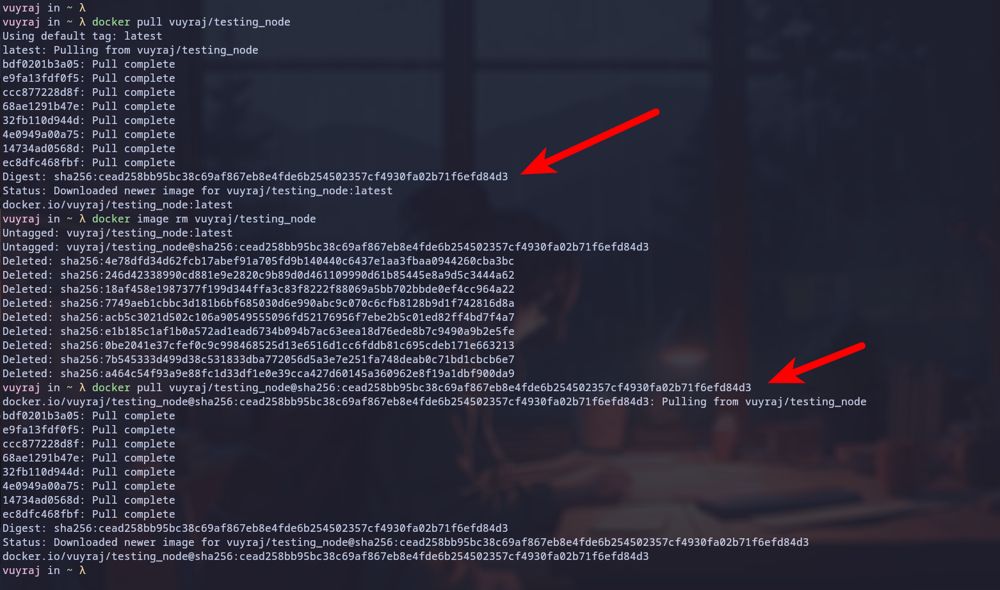
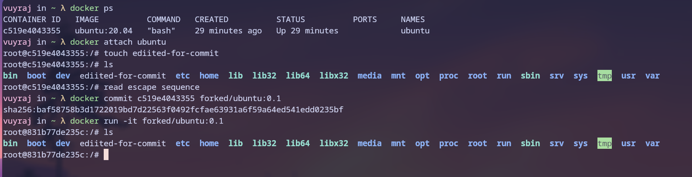

### Docker run
- It is used to start a new container, pulling image if needed.


### Docker start
- It is used to start stopped containers.
- `-a` flag can be used to attach to the container.


###  Docker stop
-  It is used to stop a running container.
- `-s` is for sending signals.
- `-t` for timeout. default for linux is 10 sec. -1 is for no timeout. 


### Docker build
Docker Build command is used to create a image from the DockerFile.
- `--build-arg`  =>  to set build-time variable
- `-f` => to specify the Docker file
- `-t` => to specify the tag of the image
- `--platform` => for specific platform
- `-o` => for specifying output type and path.


### Docker pull

Docker pull command also `docker image pull` is an command used to download container images form the registry.
- `docker pull image:tag`
-  `docker pull --platform linux/amd64 image:tag`  - to download for a specific platforom
- `docker pull --all-tags image` - to download a specfic images with all its tags
- ` docker image pull myregistry.com/testing/test-image` - from spefic registry
- We can also use digest for downloading specific image.



### Docker push

- This command is used to upload container image from the local system to the configured registry usually docker hub.
- The flags are similar to docker pull.


### Docker export

- Docker export command is used to export a container's filesystem as a tar archive.
- It doesnot include the associated volumes.
- The expored tar could be added with `docker import` command.


### Docker exec

- It is used to run a command on a running container.
- It does not work on paused container.


### Docker Search

- This command is used to search docker hub for images.
- We can format and filter the output.


### Docker Attach

- It is used to attach the host terminal's standard I/O and error to a running container using container Id ir name.
- Use ctrl+p ctrl+q to be in deatch mode. edit it by --detach-keys.


### Docker Commit

- It is used to create a new image from a running container.
- Docker freezes/ pauses the container for a while then creates the image with the previous containers's file changes or settings.
- Mouted volume data is not included.




## Docker Network

- Docker Network is a virtual network created and managed by docker which allows containers to communicate with each other and to external system and host.

- Some of the major types of docker network  include :-
#### Bridge

- The bridge driver in docker provides a software bridge to the containers running with it.
- It is default type of networking used in the docker conatiners.
-  Only containes of same  bridge could communicate with each other using ip addr or container name.
- Here all network has its own networking stack.


#### Host

- In this the container uses the hosts networking stack.
- There is no isolation between container and host.
- In it the container doesnot get IP addresses.


#### MacVlan

- This mode provides a mac address to the container so that the container can have physical address and appear device connected to a physical network with physical interface.


#### None

- It is used to completely isolate a container from the host, other containers and internet. i.e nothing external can reach the container and container can not reach external.


## Jenkins Docker Push

- Jenkins can be used to build and push the docker images to registry.
- Make sure the agent's jenkins user is in the docker group who has  root access to communicate with docker daemon.
- Use docker PAT for authentication and add it in the credentials for docker login.

```groovy

pipeline {
  agent any
  environment {
    DOCKER_CERT = credentials('dockerhub')
  }
  stages {
    stage('docker-build') {
      steps {
        sh 'docker build -t vuyraj/hello-node:1.0.0 /home/vuyraj/docker/node/'
      }
    }
    stage('docker-login'){
        steps {
        sh 'echo $DOCKER_CERT_PSW | docker login -u $DOCKER_CERT_USR --password-stdin  '
    }
    }
    stage('docker-push'){
        steps {
        sh 'docker push vuyraj/hello-node:1.0.0'
    }
        
    }
  }
}

```


