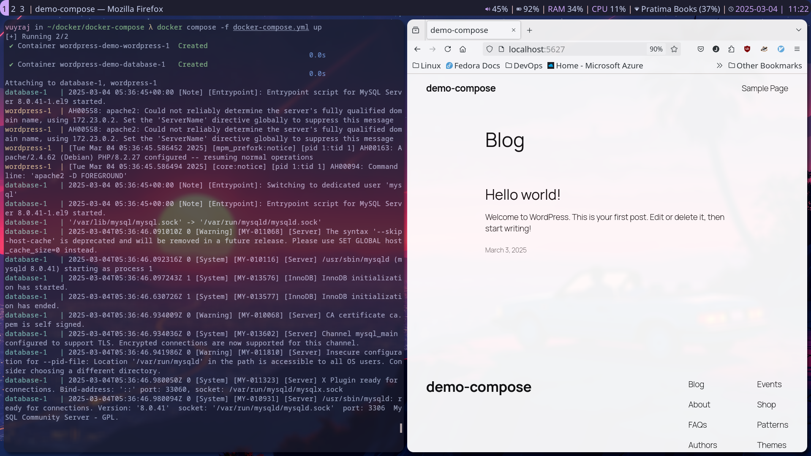

- Docker Compose is used to run and manage multi container applications.
- Docker-Compose was first developed in python and took fig.yml as configuration file.
- The compose.yml was new configuration file name.
- Later from python it was rewritten in go language.
- Then the file name was again changed to docker-compose.yaml just like the binary.
- Then the docker-compose standalone was made as plugin to the the docker.
- The docker compose plugin uses sub-command of docker and does not have its own binary.
- Then the conf file was again changed to compose.yaml .
### Docker compose for WordPress

- If name is not added at the top level then the docker compose will take the name of the parent directory.
- Services are the major section in definition of docker compose file; where each service are usually a container designed to do a specific task.
- In services environment provides a way to export the environment variable inside the container.

```yml

name: wordpress-demo

services:
  wordpress:
    restart: always
    image: wordpress
    ports:
      - 5627:80
    volumes:
      - wordpress:/var/www/html
    environment:
      WORDPRESS_DB_HOST: database
      WORDPRESS_DB_PASSWORD: passd
      WORDPRESS_DB_USER: vuyraj
      WORDPRESS_DB_NAME: worddb
    networks:
      - internal

  database:
    restart: always
    image: mysql:8.0
    environment:
      MYSQL_HOST: database
      MYSQL_USER: vuyraj
      MYSQL_PASSWORD: passd
      MYSQL_RANDOM_ROOT_PASSWORD: '1'
    volumes: 
      - database:/var/lib/mysql
    networks:
      - internal


volumes:
  wordpress:
  database:

networks:
  internal:

```

- For yaml file checking purpose we can do docker compose config.

- docker compose up starts the container.


- Some of the basic commands for docker compose include:-
- docker compose up :- for starting the services
- docker compose ps :- listing the services
- docker compose down :- stoping the container.
