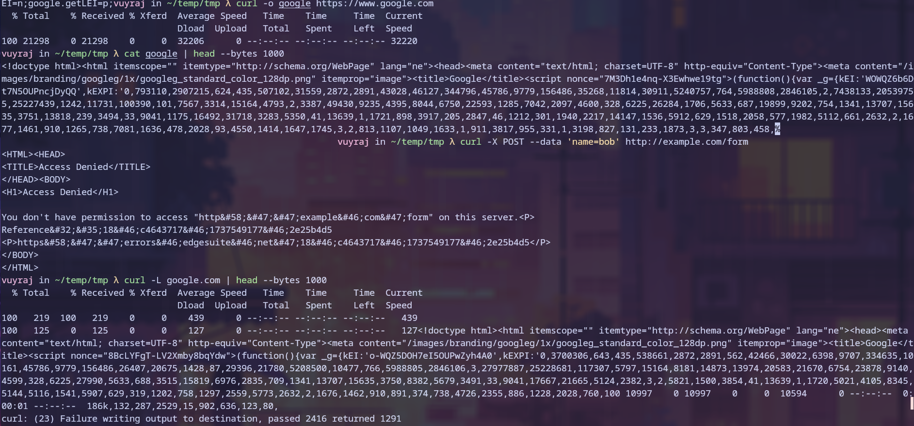
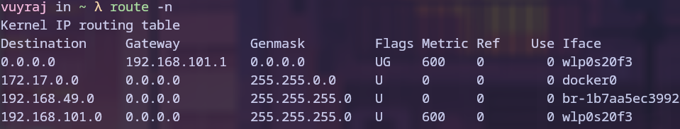
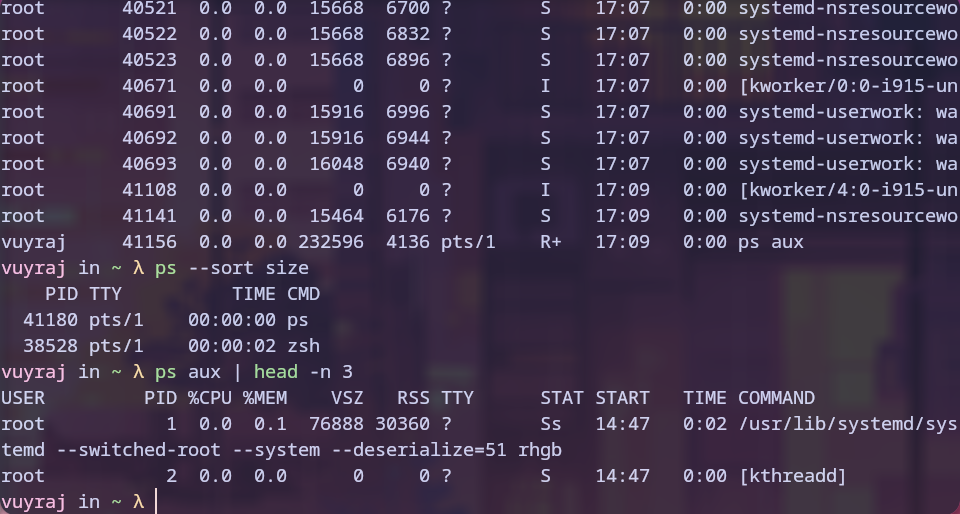
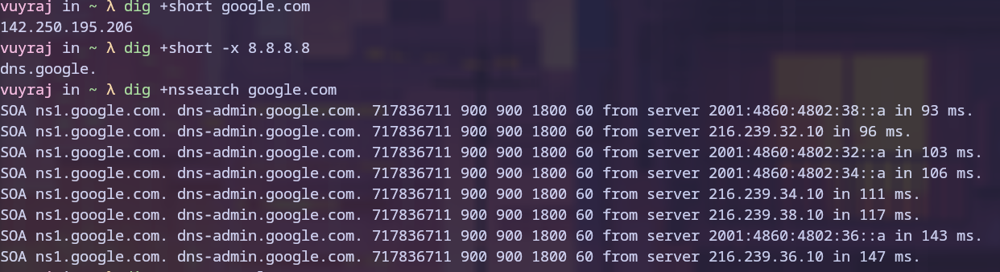
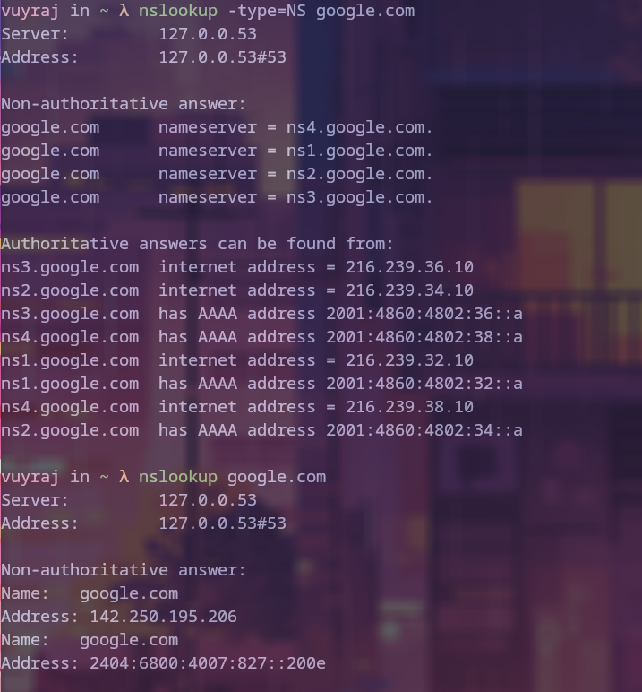
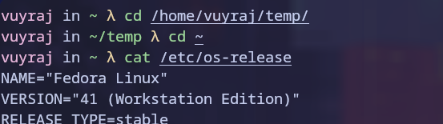
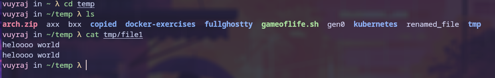
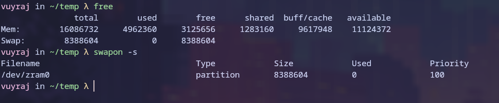

### curl
Curl is a command line tool which is used to transfer data between hosts and servers using URLs.
Curl was called curl because it included URL substring in its name. Curl accepts differnt Url. Curl operates on various protocols like http, https, ftp, ftps, imap, pop3, etc.

```
Flags:
	- L => follow the link (-- location) / redirect the link
	- v => verbose
	- T => to upload cerain datas. uses PUT
	- cert and key =>  send certificate and key for validation
```




### route
This command line tool is used to set the route table.
```
Flags:
	- n => show the information of route table
	- add => add a route rule
	- del => delete a route rule

```


### ps
This tool is used to know information about running processes.
```
- aux => used to list all the runnig processes.
- sort => sort the process 
```


### dig
This is an dns lookup utility which is used to querry DNS name servers.
```
Flags: 
	- x => perform reverse dns lookup
	- p => to specify port number
	- q => to specify query name
```


### nslookup
This is used to query name servers for various domain records.
It queries our system's default name server for an IP address (A record) of the domain. 
It obtains the mapping between domain name and ip addresses or other dns records.


### type1 vs type2 hypervisor

##### Type 1 hypervisor:
- Also known as bare-metal hypervisor.
- These hypervisors are installed directly to the bare metal hardware.
- These are almost like an light os.
- type 1 hypervisors manages and allocates the hardware resources to the VMs.
- They are generally used in organization for data centers. 

##### Type 2 hypervisor:
- Also known as embedded or hosted hypervisors.
- These hypervisors are installed on top of the host operating system.
- These are like an application which provides necessary resource to the Vm by communicating with the host OS.
- type 2 hypervisors does not have full control of hardware resources.
- They are generally used  for personal usage.

### absolute vs relative path

##### absolute path
It is the location of file or directory from the root directory.
They  are unambiguous and easy to understand
They are useful when you need to specify a file or directory's location precisely.


##### relative path
It is the location of file or directory from the current directory
Unlike an absolute path, the relative path doesn't start with a slash.
They are short and easy to understand from the current user's perspective.


### swapping
Swapping is the process of creating virtual memory in the HDD or SSD so that if there is insufficient RAM memory then, the unused or least frequently used prgram could be sent to the the Swap space which is the virtual memory.
Swapping helps by  offloading some critical process to swapspace for hibernation and safeguarding.

