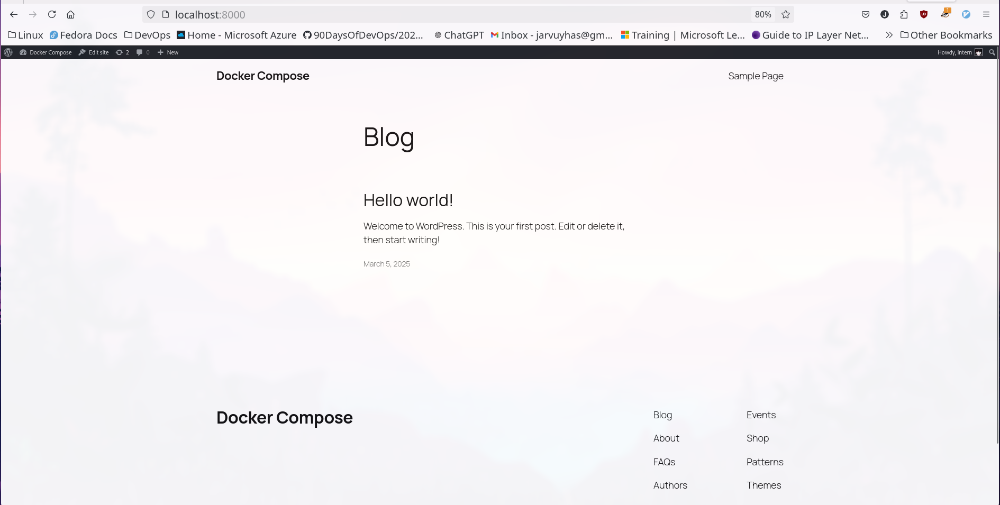
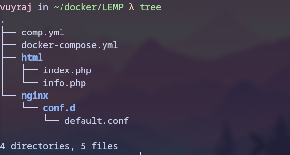
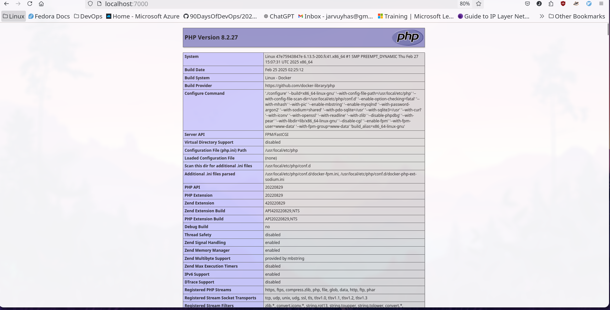
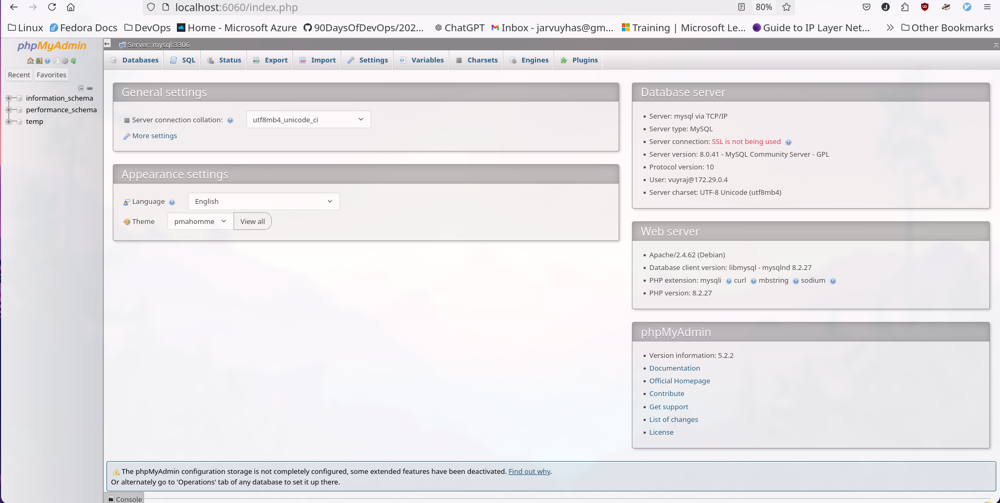

### adding a proxy in the wordpresss

```yaml

name: wordpress-demo

services:
  wordpress:
    restart: always
    image: wordpress:6.7.2-php8.1-fpm
    volumes:
      - wordpress:/var/www/html
    environment:
      WORDPRESS_DB_HOST: database
      WORDPRESS_DB_PASSWORD: passd
      WORDPRESS_DB_USER: vuyraj
      WORDPRESS_DB_NAME: worddb
    networks:
      - internal
    depends_on:
      - database
    links:
      - database
        
  database:
    restart: always
    image: mysql:8.0
    environment:
      MYSQL_DATABASE: worddb
      MYSQL_HOST: database
      MYSQL_USER: vuyraj
      MYSQL_PASSWORD: passd
      MYSQL_RANDOM_ROOT_PASSWORD: '1'
    volumes: 
      - database:/var/lib/mysql
    networks:
      - internal

  proxy:
    image: nginx:1.27.4-alpine
    restart: always
    links:
      - wordpress
    depends_on:
      - wordpress
    volumes:
      - ./nginx/conf.d/:/etc/nginx/conf.d/
      - wordpress:/usr/share/nginx/html
    ports:
      - 8000:80
    networks:
      - internal
  
volumes:
  wordpress:
  database:

networks:
  internal:

```

- Add the following for the nginx configuration ./nginx/conf.d/default.conf
```conf

server {                                                                       
     listen 80;
        server_name localhost;

  root /usr/share/nginx/html;                                                                         
                                                   
 index index.php index.html index.htm;                                      

  location ~ \.(php|phar)(/.*)?$ {
    root /var/www/html;                                         
     fastcgi_split_path_info ^(.+\.(?:php|phar))(/.*)$;                                                                                             
     fastcgi_intercept_errors on;                                           
     fastcgi_index  index.php;                                              
     include        fastcgi_params;                                       
 fastcgi_param  SCRIPT_FILENAME  $document_root$fastcgi_script_name;
 #  fastcgi_param  PATH_INFO $fastcgi_path_info;                           
     fastcgi_pass   wordpress:9000;                                              
 }                                                                                                                                                
 } 

```




### LEMP stack in docker compose

- here all the containers are linux containers.
- For php scripts we addded a php-fpm container.
- For mysqli we have added a phpmyadmin which works at 6060 port.
```yml

name: LEMP

services:
       
  nginx:
    image: nginx:1.27.4-alpine
    restart: always
    depends_on:
      - mysql
      - php-fpm
    volumes:
      - ./nginx/conf.d/:/etc/nginx/conf.d/
      - ./html/:/usr/share/nginx/html
    ports:
      - 7000:80
    networks:
      - lemp-network

  mysql:
    restart: always
    image: mysql:8.0
    environment:
      MYSQL_DATABASE: temp
      MYSQL_HOST: mysql
      MYSQL_USER: vuyraj
      MYSQL_PASSWORD: passd
      MYSQL_ROOT_PASSWORD: toor
    volumes: 
      - database1:/var/lib/mysql
    networks:
      - lemp-network

  php-fpm:
    restart: always
    image: php:8.2-fpm
    volumes:
      - ./html/:/var/www/html/
    networks:
      - lemp-network

  admin:
    image: phpmyadmin:latest
    restart: always
    environment:
      - PMA_HOST=mysql
      - PMA_PORT=3306
      - PMA_USER=vuyraj
      - PMA_PASSWORD=passd
    #  - PMA_ABSOLUTE_URI=http://localhost:7000/admin/
    depends_on:
      - mysql
    networks:
      - lemp-network
    ports:
      - 6060:80
        
volumes:
  database1:

networks:
  lemp-network:


```

```conf
server {
    listen 80;
    server_name localhost;

    root /usr/share/nginx/html;

    index index.php index.html index.htm;

    location ~ \.(php|phar)$ {
        root /var/www/html;
        include fastcgi_params;
        fastcgi_split_path_info ^(.+\.php)(/.*)$;
        fastcgi_pass php-fpm:9000;
        fastcgi_param SCRIPT_FILENAME $document_root$fastcgi_script_name;
        fastcgi_param PATH_INFO $fastcgi_path_info;
        fastcgi_intercept_errors on;
    }

```







