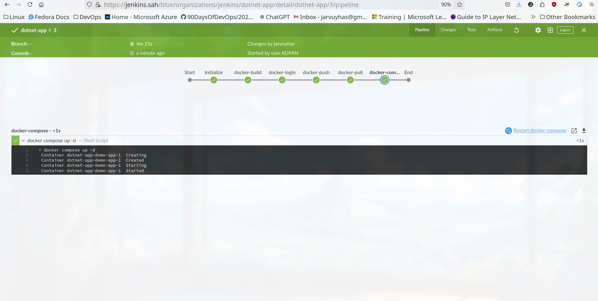
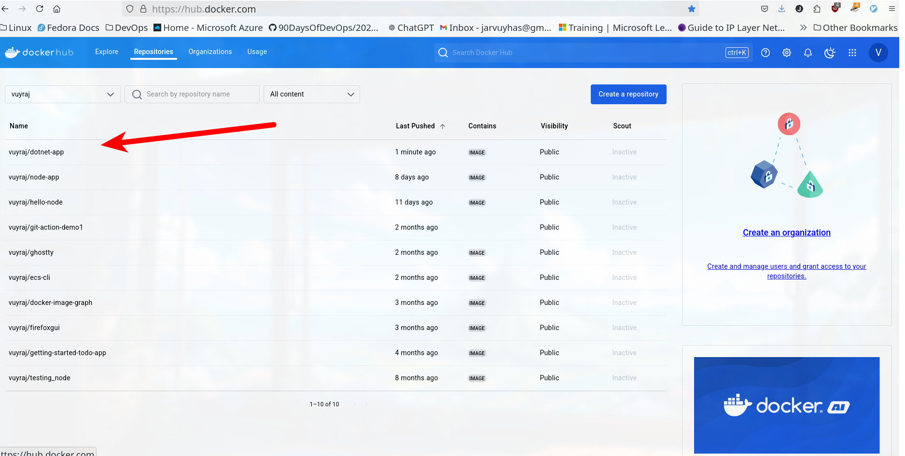
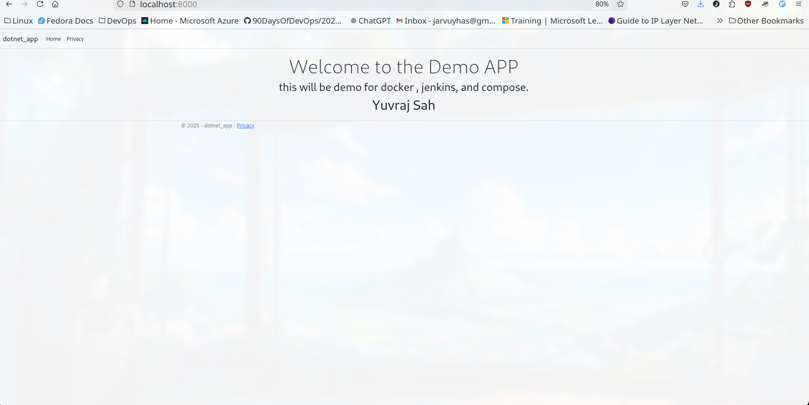

### A Jenkins pipeline that containerizes the application, publishes the container image, and later deploys it using Docker Compose.

1. Jenkinsfile
```jenkinsfile
pipeline {
  agent any
  environment {
    DOCKER_CERT = credentials('dockerhub')
  }
  stages {

  
  stage ('Initialize') {
    steps{
      sh 'chmod +x script.sh'
      sh './script.sh'
    }
  }
    stage('docker-build') {
      steps {
        sh 'docker build -t vuyraj/dotnet-app:1.0-8 .'
      }
    }
    stage('docker-login'){
        steps {
        sh 'echo $DOCKER_CERT_PSW | docker login -u $DOCKER_CERT_USR --password-stdin  '
    }
    }
    stage('docker-push'){
        steps {
        sh 'docker push vuyraj/dotnet-app:1.0-8'
    }
    }

stage('docker-pull'){
        steps {
        sh 'docker pull vuyraj/dotnet-app:1.0-8'
    }
    }

stage('docker-compose'){
        steps {
        sh 'docker compose up -d'
    }
    }
    
  }
}


```


4. script.sh
Make sure docker is installed or not . I am using the node's agent so there is no need. If using 
```sh
cd ./dotnet-app
docker version
dotnet clean
dotnet publish -c Release


```

2. Dockerfile
```Dockerfile

FROM mcr.microsoft.com/dotnet/sdk:8.0 AS building

WORKDIR /app

COPY ./dotnet-app ./

RUN dotnet restore

RUN dotnet publish -o output


FROM mcr.microsoft.com/dotnet/aspnet:8.0

WORKDIR /app

COPY --from=building /app/output .
EXPOSE 8080
ENTRYPOINT ["dotnet", "dotnet-app.dll"] 

```

3. Docker-copose.yml
```yml
name: dotnet-app-demo

services:

  app:
    image: vuyraj/dotnet-app:1.0
    restart: always
    ports:
      - 8000:8080

```






