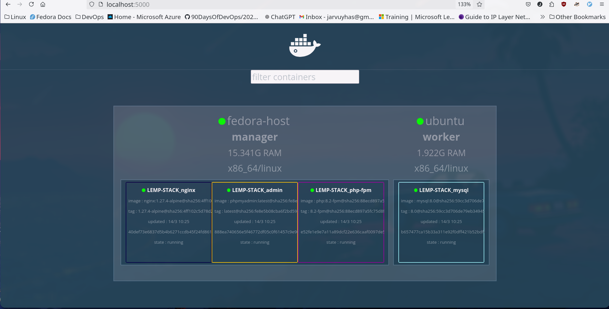
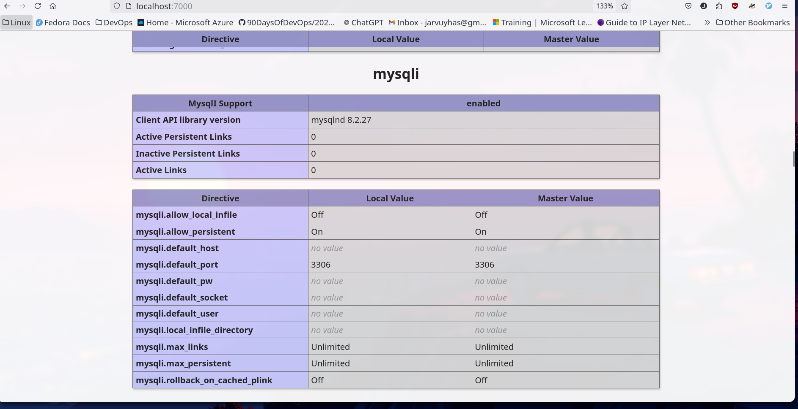
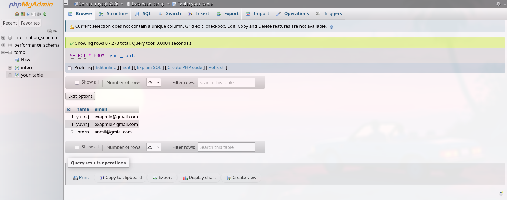
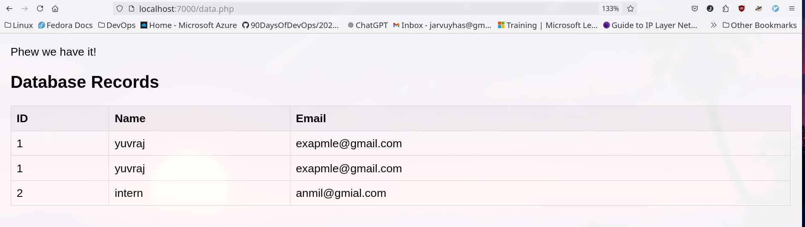
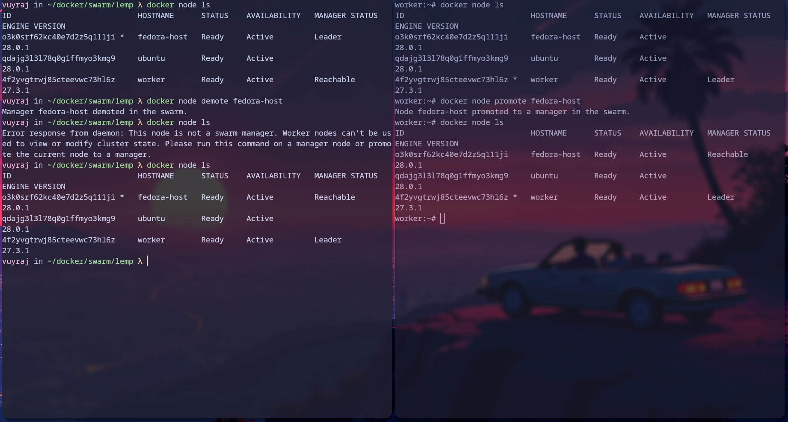
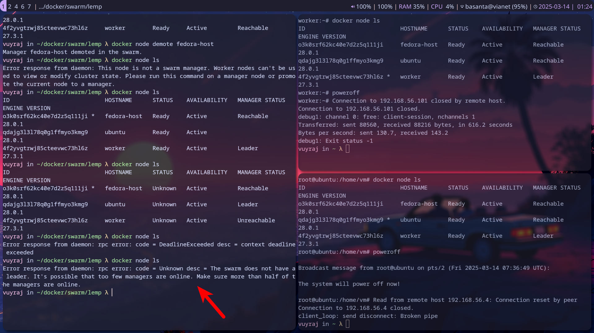

### Deploy LEMP stack in docker swarm

1. Compose file
```
services:
       
  nginx:
    image: nginx:1.27.4-alpine
    volumes:
      - ./nginx/conf.d/:/etc/nginx/conf.d/
      - ./html/:/usr/share/nginx/html
    ports:
      - 7000:80
    networks:
      - lemp-network
    deploy:
      replicas: 1
      restart_policy:
        condition: on-failure
      placement:
        constraints: [node.role == manager]


          
  mysql:
    image: mysql:8.0
    environment:
      MYSQL_DATABASE: temp
      MYSQL_HOST: mysql
      MYSQL_USER: vuyraj
      MYSQL_PASSWORD: passd
      MYSQL_ROOT_PASSWORD: toor
    volumes: 
      - database1:/var/lib/mysql
    networks:
      - lemp-network
    deploy:
      replicas: 1
      restart_policy:
        condition: on-failure
      placement:
        constraints: [node.role == worker]

  php-fpm:
    image: vuyraj/php-fpm:8.2-mysqli
    volumes:
      - ./html/:/var/www/html/
    networks:
      - lemp-network
    deploy:
      replicas: 1
      restart_policy:
        condition: on-failure
      placement:
        constraints: [node.role == manager]

  admin:
    image: phpmyadmin:latest
    environment:
      - PMA_HOST=mysql
      - PMA_PORT=3306
      - PMA_USER=vuyraj
      - PMA_PASSWORD=passd
    ​networks:
      - lemp-network
    ports:
      - 6060:80
    deploy:
      replicas: 1
      restart_policy:
        condition: on-failure
      placement:
        constraints: [node.role == manager]


volumes:
  database1:

networks:
  lemp-network:
    driver: overlay
    attachable: true


```

- Here database is in worker node and other are in manager node.
- We can change constraints from role to `node.hostname==ubunu` as well as `node.label.mysql==true`




- To check if it is working or not i have created a database and tried to access it.
- there was no mysqli in the php so i had to create  anew image with mysqli added.








### docker qourum

In docker Swarm, Qourum is a minimal number of manager node in a swarm which is needed to make the Cluster remain functional even if some node fails. The quorum value is based on the Raft consensus algorithm.
- `Qourum = (N/2) + 1` which means the qourm is greater than 50% of the manager node.
- - To find the failure tolerence :`(N-1)/2` for the formula.
- Example: In a swarm of 9 manager node. 9/2 + 1 = 5.5 , so it requires at least 5 functioning node for proper working. if there are only 4 functioning left the the management of cluster fails. And (9-1)/2= 4 which means up to 4 failures are allowed.

| Total Manager Nodes | Required for Quorum (Majority) | Fault Tolerance (Failures Allowed) |
| ------------------- | ------------------------------ | ---------------------------------- |
| 1                   | 1                              | 0                                  |
| 3                   | 2                              | 1                                  |
| 5                   | 3                              | 2                                  |
| 7                   | 4                              | 3                                  |
| 9                   | 5                              | 4                                  |


- Demoting a  manger could lead to the change of leader.
- Here we can see there is only on leader in the manager node others are on reachable status.


- Now converting all the node to manager and shutting down 2 manager leads to error.
- The swarm could not select an leader.

