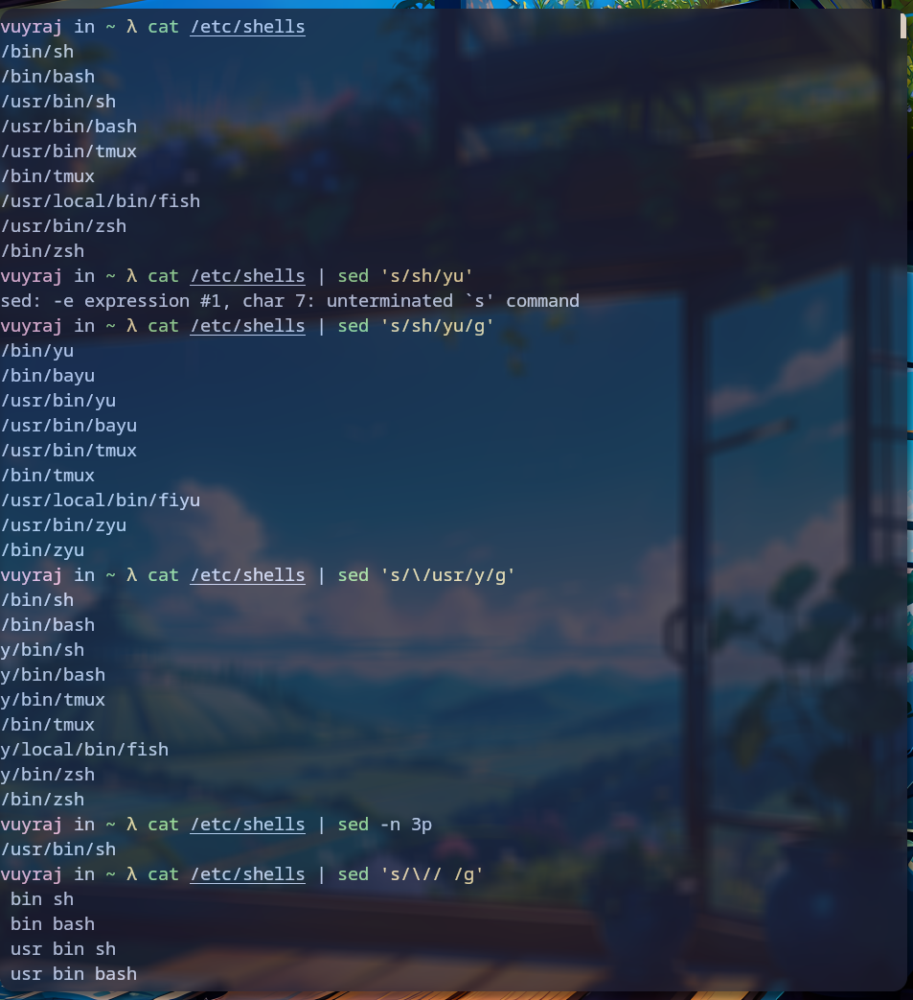

### vi

Vim is a command line editor which is defaultly installed in linux. It has several modes, some of them are: 
```
- Normal Mode : Used to enable vim commands 
-  Visual Mode: it is read only mode used for selecting usually
- Insert mode : It is simply used to write 
 
```


### Grep
This command is used to find patterns in files or texts using regular expressions.
```
Flags:
		- F => disable regular expression search
		- r => search recursively
		- o => print for only matching
		- v => print inverted match (lines that do not match a pattern)

```


### sed

SED is short for string editor. It is mainly used to replace string. It edits text in an editable manner.
```
flags:
	- f => for specific file
	- n => only show the matched 
	- i => for editing in same file / rewrite
	- E => Extended regex

scripts:
	- d => delete
	- s => substitute
	- g => global
	- p => print

```


### awk

awk is an tool which has its own scripting/programming language ; which is used to deal with files.
awk is mainly used to extract certain texts from a text file. It could be used to extract columns, lines, matching string. It is an powerful tool as it has its own scripting language.
```
script:
	- {print}
	- {if}
	- {for}
	- length() => gives length
	- NR => the total no of input records so far.
	- BEGIN => from begining
	- END => for ending
	- RSTART => gives index no
	- NF => the no. of fields in the current record
flags:
	- F => it is used to specify field seperator to use.
note:
	- $1 => for first column
	- $2 => for second column
	- $0 => for everything
```


### linux file hierarchy system

1. / => It is the root directory itself
2. /bin => In it all the binaries and executables reside
3. /boot => It contains file necessary to boot the system . It requires superuser to modifiy it. 
4.  /data => It is is often used for storing large amounts of data, such as user-generated content, databases, or application data.
5.  /dev => it conatains all the device information
6.  /etc => It holds system-wide configuration files for various programs and services.
7. /home  => It is the default location for user home directories. Each user typically has their own subdirectory within /home.
8.  /lib => It contains shared libraries and other essential files for programs to run.
9. /lib64 => It is similar to /lib but specifically holds 64-bit libraries.
10. /lost+found => It may contain files that the system couldn't link to their original location during a file system check.
11. /media => - It is the mount point for removable media devices such as USB drives, external hard drives, and CDs/DVDs.
12. /mnt =>It is an another mount point for temporary file systems.
13. /my => It is a non standard directory. 
14. /opt => It is used for installing additional software packages.
15. /proc => It is a virtual file system that provides information about the system's processes and kernel. It contains items while booting.
16. /root => The home directory of the superuser.
17. /run => It stores runtime files and data for the system, such as PID files and socket files.
18. /sbin => It contains the system binaries.
19. /snap => It is used for storing and running applications packaged in the Snap format.
20. /sys => It provides an interface for interacting with the kernel and hardware devices.
21. /tmp =>  It is sed for temporary files that are not critical and can be deleted at any time.
22. /usr => It contains user programs, libraries, and documentation.
23. /var => It conatins variable file which may change any time frequently, such as log files, mail queues, and temporary files.


