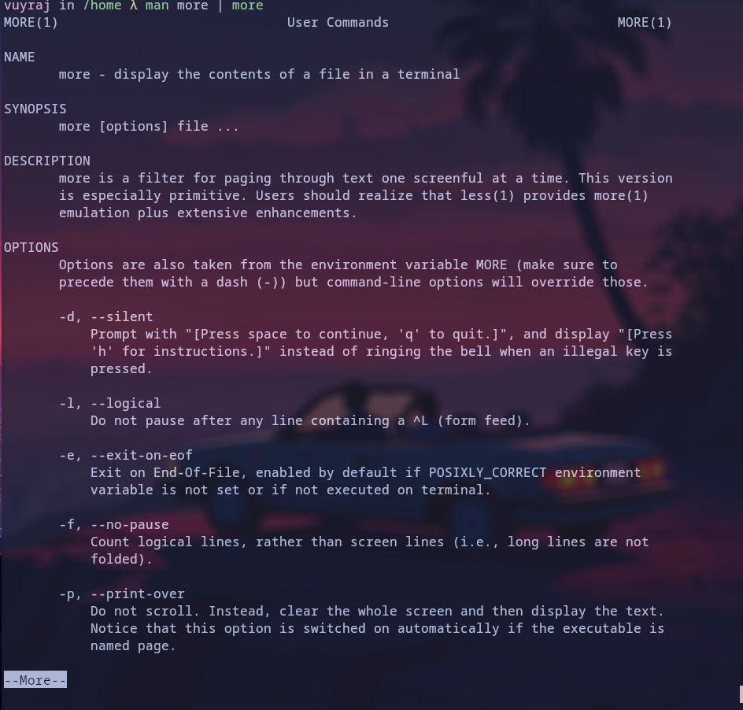
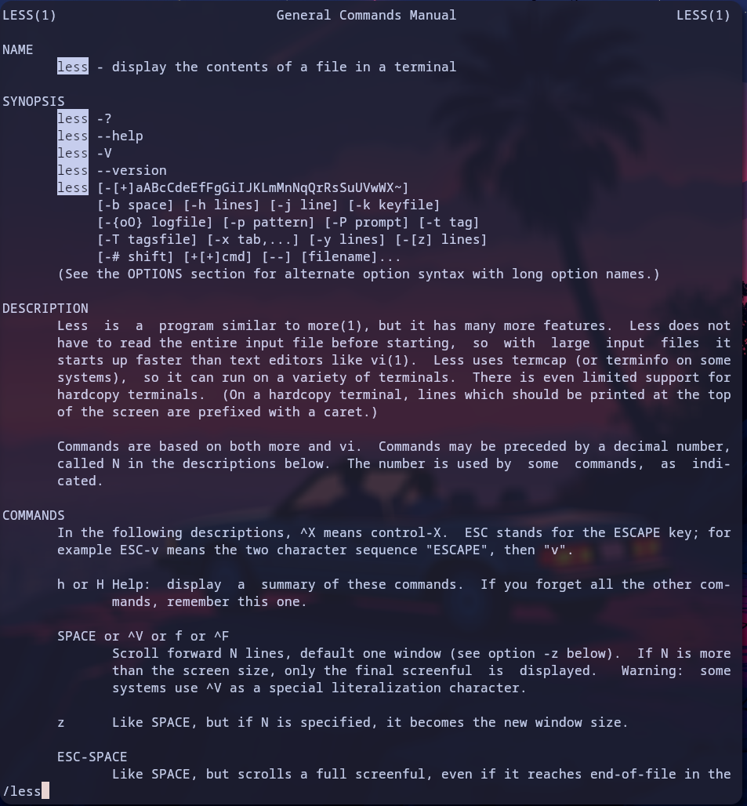
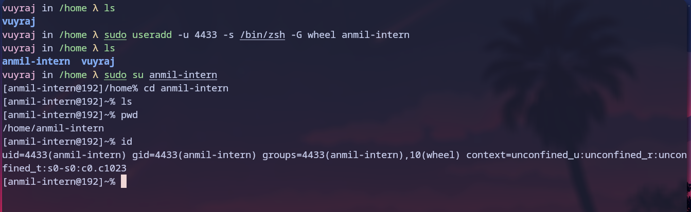
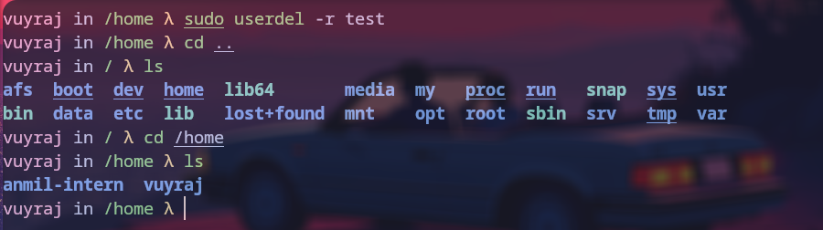
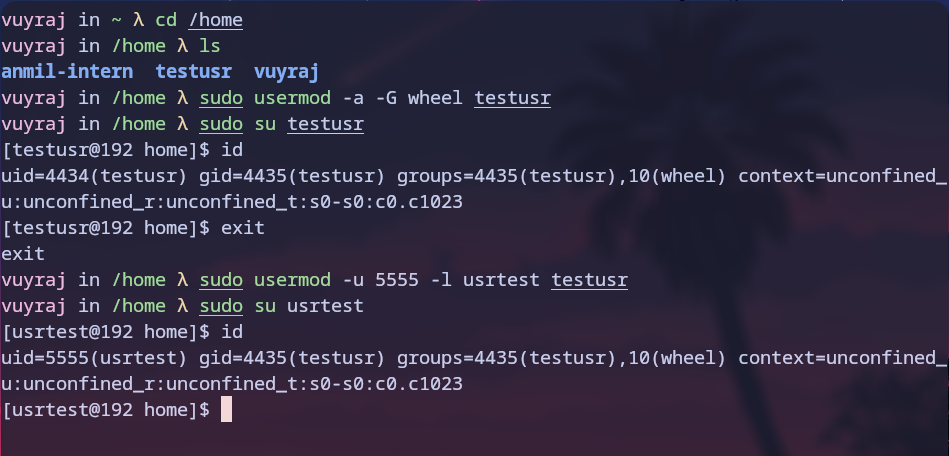
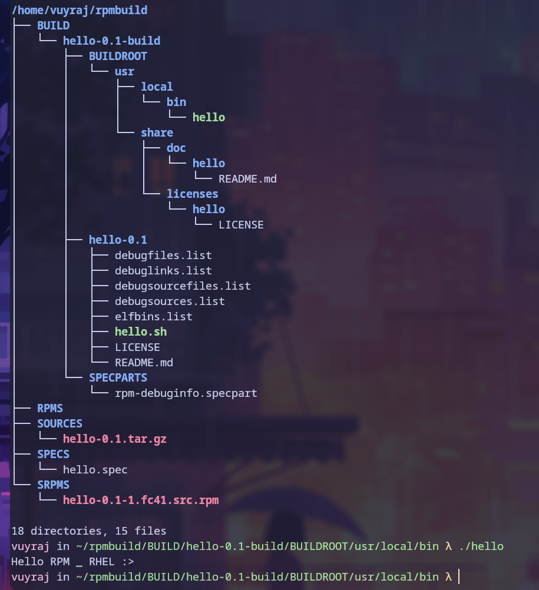

### File system types (ntfs vs fat  vs xfs vs ext)


### ext
The ext file system wad build by the Linus Torvalds. He used minux FS which was for mini computer mainly later he wanted a open source FS for the linux personal computer. The ext  was unstable and was not much used.
Later ext2 came out which was more stable and was widely used and popular. It uses  inodes table , where it has info related to data blocks and pointer to the block.
if there is an empty file a little data file then it could be stored in the inode tble.


ext3 adds  jouranaling for fast and grace-full recovery.  
Ext 4  is and improved version and adds various functionality and has high capacity.

ext2 , ext3 and ext4 are inter compatible with each other. We just need to un mount and mount with desired ext_ and we can run it , just he functionality of ext4 will not be in ext3 and ext2.

It has low  fragmentation and need for de=fragmentaion is low only needed when the storage is almost full and even after de-fragmentation only slight improvement is noticed .


### fat
- Fat ( file Allocation Table ) is created during the process of formatting and the table is for entries of linked list  of each clusters . Clusters are the contagious area of the disk storage. As clusters are in linked list , os must travel through the list to reach the desired file or directory.
- Even if a file is created, it allocates a cluster which will take space.
- FAT is slow and its capacity is low.


### ntfs
- NTFS, which stands for **NT file system** and the New Technology File System.
- windows native file system
- It fragements badly and need for the de-fragmentation is weekly.
- It supports large capacity upto 16 exb.
- Ntfs also uses clusters system whose size may be 512 bytes to 64 kb.
- When a file is created , a record about the file is created in the Master File Table (MFT). The record is used to locate a file's possibly scattered clusters.
- metadata is tored with the file.

### xfs
- It was built for storing large images. For data centers.
- It supports multi thread access and good for the large files.
- As images are large in size , it uses more cpu.
- It does not recover gracefully.
- It does not check for the file system' s crash or curruption while booting. 
- it is also supported by linux deeply.


### Why is root account's home directory separate ?

/Root is the root's account default home directory. It is separated  from other users and not kept inside /home due to various reasons, some of them are :-

- The /root directory's files require superuser privilege to access them and the files are sensitive in nature. If the /root is kept inside /home , then it would require admin to adjust the privelages for /home/root which will be complex. Unlike now where /root privelage is root by default.
- If all users directory are in same /home directory then some files might affect the /home/root as well. There is a chance of accidental modification or deletion.
- Another reason is for isolation of /root. 
- If system crashes and admin need to login as single user which is root  for recovery purpose. If /root is in / then it will be easier to access and recover and /home might not be accessible as it might be mounted from another drive/ partion , sometimes /home' s user related file might be the reason for the crash, So it is important that root remains isolated.
- /root is nearer to /etc /bin id it is in / , as it only needs ../etc ../bin to access but if it is in /home , it may require ../../etc.


```
When hard drives were much smaller, /home used to be on a different partition (or even disk)... and was mounted comparatively _late_, when the system went "up".

In contrast, `/root` was deemed essential for system maintenance purposes, and thus had to be present at any rate - even when the "user disk" wasn't mounted.

```


### Commands :- 


### more
This command is used to interactively display a file. It allows scrolling and searching. It is the one of the oldest commands. Previously it used to only forward scrolling. now backward scrolling is also supported.



### less
It is a Pager.
This command is used to interactively display a file. It allows scrolling and searching. One of the reasons why less was introduced was to allow backward movement line by line. It has a lot of commands that are similar to the _vi_ text editor’s commands, and it supports horizontal scrolling, live monitoring, and more.


### useradd
This command is used to create a new user.
```
Flags:
- l => login (change username)
- u => user id
- s => shell
- a => append
- G => groups
- d => path to home directory

```



### userdel 
This command is used to delete a user.




### usermod
This command is used to modify a user account.



### What the following files contain:
  
   
#### i) /etc/passwd

This file include users and its associated data.A whole single line describes about a user. This file contains :-
1. users
2. password
3. user id
4. group ids
5. user info
6. home directory
7. user shell (which is started when user login to the system)

#### ii) /etc/group
This file only contains groups and its associated users. It is one entry per line file which includes:
1. group (name)
2. password
3. group Id (GID)
4. group list (users ; seperated by comma)

The group is mainly used for managing users and giving them required privileges only. Every group can have administrators, members and a password.

The main function of group is to provide certain permissions to users that belong to it.
The main function of wheel group is to provide permissions that the associated users can elevate their session as superuser or root. the wheel groups users atre allowed to run su.


#### iii) /etc/shadow

The shadow file is used to record the password and its expiration date.
It is also an entry per line file. The shadow file includes :-
1. user
2. password in hash (format ` $id$salt$hashed`)
3. last password chang
4. minimum  (time to be able to change password)
5. maximum (valid period in days)
6. warn (when to warn)
7. inactive (till when to be disabled after expires)
8. expire


### dpkg vs apt

- Dpkg is the debain based low level pakage management tool.
- apt is the advanced package management tool used in debain based distro.
- Dpkg does not do depedency resolving while apt does.
- dpkg has no cache while apt does have.
- apt downloads the packages online and then install it, dpkg controls from local .deb packages.
- apt removes unwanted dependency automatically while in dpkg there is no such thing
- apt is used by the end users while dpkg are used by sys admins.
- apt uses dpkg as backend.


### yum vs rpm

- Yum is yellowdog update modifier (same as apt ). It was deprecated , Now it became an alias for latest dnf5.
- RPM is Red Hat package manager (same as dpkg) which works in RHEL based systems to manage packages.
- Using rpm is complicated and requires caution if some flags are wrong then the installation may be unstable while yum is automatic and provides ease of usability.
- rpm uses flags to install, remove and update while yum uses sub-commands.

The rpm package is build by the following needs: 

build the source code which might be binary compiled (specific aarchitecture) or interpreter based (no aarchitecture).then license and its documnetation.  
  
all of them are archived in tar.gz or .tgz.  
then we require a SPEC file which describe how to build the rpm package.  
from SPEC file we can build source-rpm as well as rpms.  
and at last from rpms we can install it on our computer.

