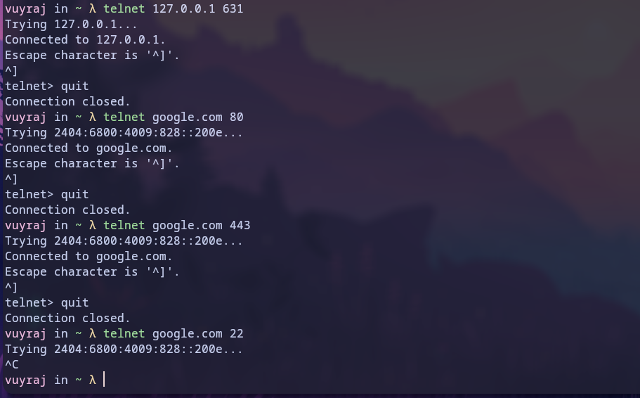
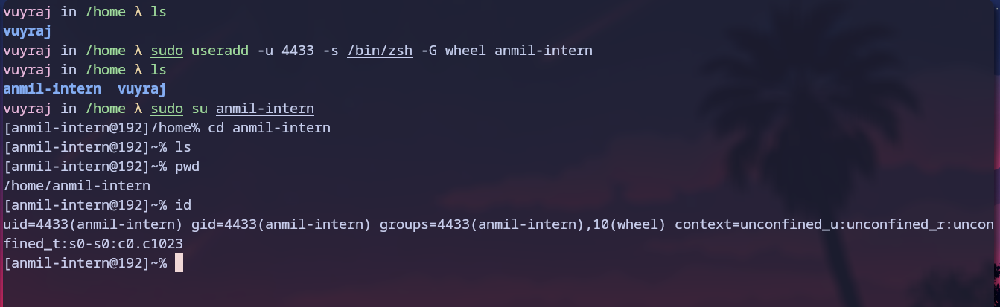
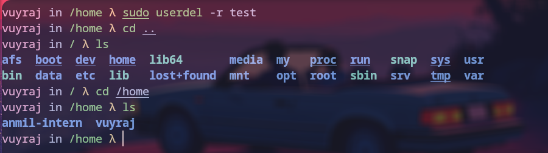
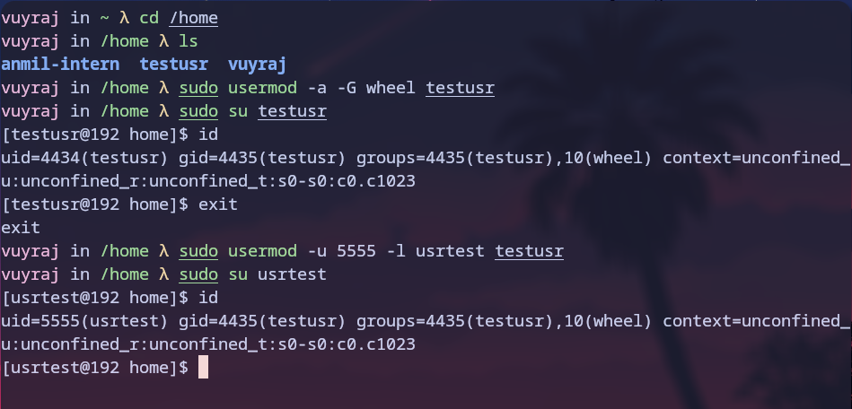

### Netstat

Netstat (Network Statistics) is a command used to know/print the connections established by the host and some details related to connections like protocol, local ip and port, foreign ip and port, state of connection, program id used for connection.
```
Flags
	- a => shows all the current active connection 
	- p => shows which program uses this connection ;in the form of program id
	- n => shows data in numeric form. without resolving hostname, fqdn, ports
	- l => shows the listening ports only
	- t => for tcp connection only
	- u => for udp connection only
	- x => for unix ports
	- s => print statistics for all protocols
	- r => routing information
	- i => interface information

```


### Telnet

Telnet is a command used to connect to remote host. It has low security as it uses clear plain text for communication. So, it is not much use. I can also be used to check if a port is open or not . It allows 2 way communication between hosts.




### Firewall
It is a program used to protect the device from the unwanted traffic from the internet.

firewalld is a service daemon that provides basic dynamic customizable host based firewall with d-bus interface.

firewalld uses the concepts of zones and services, that simplify the traffic management.


### ufw

Also known as uncomplicated firewall.
It uses iptables to make configuring firewall easier.


### /etc/passwd

This file include users and its associated data.A whole single line describes about a user. This file contains in order :-
1. users
2. password
3. user id
4. group ids
5. user info
6. home directory
7. user shell (which is started when user login to the system)

### chmod
This command changes the access permissions of a file or directory.
```
args:
		- u => user to which permission change is applicable
		- o => others
		- g => groups to which permission change is applicable
		- + => gives rights/ permissions
		-  - => remove rights/ permissions]
		- r => read file permission
		- w => write file permission
		- x => execute file permission
```

numbers system for changing mod
```
r w x       =>    numbers

0 0 0       =>      0
0 0 1       =>      1
0 1 0       =>      2
0 1 1       =>      3
1 0 0       =>      4
1 0 1       =>      5
1 1 0       =>      6
1 1 1       =>      7

```
No we can change the permissions by using the numbers. If we need to give all the permission rwx to all users, groups, others we can do 777.
Eg. if we want to give rw permission to user, rx to groups and no to others then the code combination will be 650 


### chown

It is used to change user and group ownership of files and directories.
```
Flags:
	- R =>  Recursively change the owner of a directory and its contents
	- h => Change the owner of a symbolic link
```


### top

 Display dynamic real-time information about running processes
the first five lines display
- `top` displays uptime information
- `Tasks` displays process status information
- `%Cpu(s)` displays various processor values
- `MiB Mem` displays physical memory utilization
- `MiB Swap` displays virtual memory utilization
Some commands on top of top used are:
```
	- i => displays running process
	- 1 => displays cpu core usage
	- k => to kill process id
	- M => sort by memory
	- P => sort by cpu
	- f => field management (add/remove/sort)
```


### ps

PS command is used to show the running process. In default it shows the running process of current shell.

The columns show these information.
- PID => the unique process ID 
- TTY =>terminal type that the user is logged into 
- TIME => amount of CPU in minutes and seconds that the process has been running 
- CMD => name of the command that launched the process.


### useradd
This command is used to create a new user.
```
Flags:
- l => login (change username)
- u => user id
- s => shell
- a => append
- G => groups ; sets list of groups
- d => path to home directory
- g => group-id ; it sets primary group

```



### userdel 
This command is used to delete a user.




### usermod
This command is used to modify a user account.




### sysytemctl

This a powerful command line utility which is used to control the systemd system and service manager.
```
args:
		- status
		- start|stop|restart|reload|status
		- enable|disable
		- daemon-reload
		- is-active|is-enabled|is-failed unit
 ```


### journalctl

It is used to query the systemd journal. It is used to view the logs wherever its origin might be.
```
flags:
	- u => unit 
	- b => boot id
	- o => output
	

```


### Shell Scripting


Shell Script is an program which include list of commands which is used by the operating system (shell) to perform certain tasks for automation of tasks and testing purpose.
It is an interpreter based program.
- At first create a file with extension .sh
- in the first line #!/bin/bash    which will tell which shell to execute the file.
- write your shell script after it.
- Then change the permissions to make it executable.
- then we can execute by writing its path in the shell.
- we can also make it executable from anywhere by keeping it in the /bin/bash or any $PATH.


### Questions

###  Create a user tom having sudo privilege and home directory as /home/tom.


###  Create user cat without sudo privilege and without home directory.


###  Create a file from user tom and edit it from cat user.


###  Write a script named helloworld.sh to display “Hello World”.

```
#!/bin/bash

echo "Hello world"

```


###  Write a script named display.sh to prompt for a number and display it.

```
#!/bin/bash

num=""

while [[ ! $num =~ ^[0-9]+$ ]]
do 

	echo "enter a number."
	read num
	
done

echo "The numer you enterd is :- " $num

```


###  Write a script to determine if a user-inputted number is positive, negative, or Zero.


```
#!/bin/bash

echo "enter a number."
read num
	
if [ $num -gt 0 ]
then
echo "The numer you enterd is positive. " 

elif [ $num -lt 0 ]
then
echo "The numer you enterd is negative. " 

else
echo "The numer you enterd is zero. " 

fi

```

