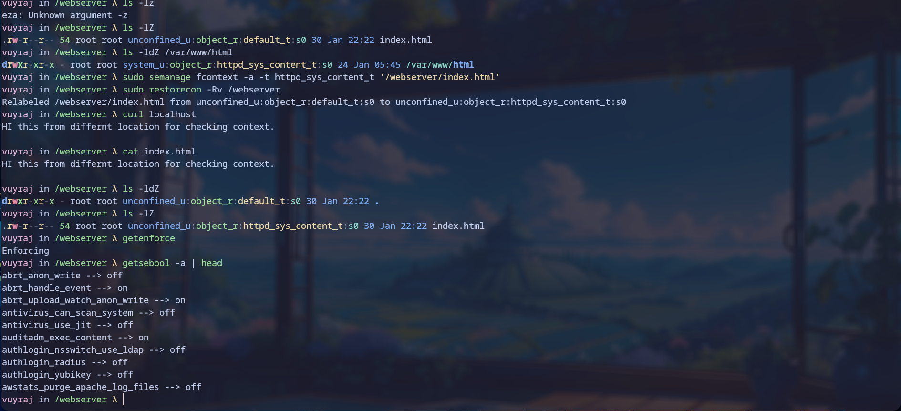

#### SELINUX (Security Enhanced Linux)

- SELINUX is an security mechanism to secure the computer by controlling who could access the system. It was developed by NAS for unix based os. 

- DAC (Discretionary Access Control) is an access control technique where the owner could control the file however they like. The root user is omnipotent. In DAC a user could modify the permission of file which they own .

- MAC (Mandatory Access Control) is an access control method where the administrator will define certain policy which will override DAC of user. It acts as a control / safety mechanishm to be safe from the risk of DAC.

- SELINUX uses policy to control a computer in a fine grained manner ; they could control :- user,files, Directories, Memory, Sockets, TCP/UDP, ports, etc.
- policy types are of targeted (default) and mls (multi-level / multi category security.)
-  Core part of SELINUX   is type enforcement . Its type include :- enforcing (where no policy is allowed to breached ) and persuasiveness (where only logs are kept if policy are breached).
- Another core part is Labeling . which is used to label files, messages, ports, etc with an SElinux context.
	- Files and directories ; these labels are stored as the extended attributes on the file system.
	- For processes, ports ; the kernels manages these labels
	- label =>   user : role : type (context) : level
- We can view the labels of file, process, network , ets using `-Z` flag in the command like `ls -lZ` , `id -Z` `ps -Z` `netstat -Z` `cp -Z` `mkdir -Z` 
- Contexts are set when files are created based on their parent directories context.
- The context which are mainly transited from parent directory . there might be some exception like in resolv.conf has different context than /etc its parent directory.
- The applications of a context could access only its child context. Example a httpd server could only access httpd_t type not others like user_t.
- Errors in SELINUX could occur due to mislabel, policy tweak, and bugs.

- Boolean are on/off settings for the SELINUX.
- we can use  boolean data by `getsebool -a`

-  `chcon` is used to change context. its syntax is `chcon -u user -r role -t contex_type_t -l level path/to/file`. we can use `chcon -t ` only for changing context . 
- `chcon --refrence /path/to/f1 /path/to/file` is used to make the context same as the f1 for the file.
- After changing context we need to `restorecon -Rv /path/to/file` to adjust the context, i.e apply it recursive in the directory.
- when we copy  a file its context is renewed while we move file the previous context will be copied which will lead to an error.
- to change the type of enforcement `setenforce 0|1` where 0 is for persuasiveness and 1 for enforcing.




### ACL

ACL (access control list) is a way to manage the file permission more granually. It extends the DAC and allows a specific user to have certain permissions to the file.
To get the ACL of a file we use `getfacl` command and to set ACL of a file we use `setfacl` command.
```
Flags for setfacl :
	- m => modify
	- b => remove
Flags for getfacl :
	- n => Display the file access control list with numeric user and group ID
	- t => Display the file access control list with tabular output format
```


### Sticky bits

Sticky bits is a way to control access management of the file. It is used so that a file could be only renamed or deleted by the current file owner or directory owner or root user. It can be specified by `chmod +t` for adding sticky bits and `chmod -t` for deleteing it.
```
chmod number for controlling
SUID => 4
SGID => 2
Sticky bits => 1
```

SUID is kept so that file is executed as the owner ; regardeless of whomever the file is executed by.
SGID;  set at the directory then any file created in the directory will have gorup ownership set to the directory owner set at the file then it allows the file to be executed as the group that owns the file

### Scheduling 


Scheduling is the process of running tasks at specific period of time.

### Crontab

A cron is a system scheduler used for running jobs or task unattended at specfic period of time. Crontab is used to manage cron jobs on a time interval for the user.
its format is 
```
minute hour day(month) month day(week)  script/command
eg:
30 2 * * Fri /absolute/path/to/script.sh
which runs a  script at 02:30 every Friday:

	- *   => any value
	-,    => value list separator
	- -   => range of values
	- /   => step values
```


### AT
At is used to execute the command with /bin/sh at later period of time. we can use `atq` to check when our command will run


### Process tree

The linux is an multiuser OS , and each user has its own process running. To view the process of user in a tree like graphical format we could use `pstree` command. The process tree is a diagrametic representation of process in it tree format. The tree shows the relationship between the parent and the child. 
```
Flags:
- C => color now supported as age only
- p => shows the program id
- Z => shows the SELINUX label
```

We could also see the process tree by `tree /proc` as the tree is used to list files in tree format. As linux is file based, even its process are files which are stored in the `/proc` directory.

