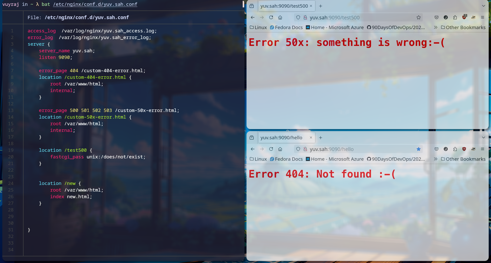

### Proxy

- Proxy server are the mediator server which is between the client requesting the service and the server providing the service.
- Forward proxy is the proxy server used by clients and those proxy server access the server providing the services. It provides clients the security and enhances the policy enforcement in the internal network.
- Reverse Proxy is the proxy server used by the servers to protect themselves from the malicious users / clients. The reverse proxy appears as the simple server to the user. It routes the traffic of the clients and helps in load-balancing.
- Nginx is made to be a reverse proxy.

### proxy_pass

- Proxy_pass is the directive used to  map the incoming uri to the proxied server's location.
- syntax `proxy_pass URL;`
- The proxy_pass is used inside the location block. So its context to be use is location.
- If a domain addresses several ips , then all of these ips will be used in round robin.
- If there is no uri in the proxy_pass url then the requested uri is appended at the address.
- If ther is uri in the proxy_pass directive then the matching uri is replaced by the proxy_pass directives uri. and then sent to server for further processing.


### proxy headers

- `proxy_set_header field value` ; this command is used to redefine or append fields to the request header passed to the proxied server. Its context are `http`, `location`,`server` . The  value can contain text, variables and their combination.
- By default, NGINX redefines two header fields in proxied requests, “Host” and “Connection”, and eliminates the header fields whose values are empty strings. 
- “Host” is set to the `$proxy_host` variable, and “Connection” is set to  close.


- `proxy_hide_header value;` directive sets additional fields to be not passed to the proxied server in addition to the default fields like Date, server,X-Pad,etc


- `proxy_pass_request_headers on | off;` this directive indicates whether to pass the header from the original request to the proxied servers.  


### custom error page

- We can create error page according to our organization need and the use the error page in nginx for displaying errors.
- the error page directive is inside the server context.
- syntax `error_page error-code /location`
- the location block related to the error code can have internal directive so that the error page will not be accessed by the users/clients.





#### Create a test2.conf and listen on port 82 and to “location /test/” with message “test is successful”

```
server {
	listen 82;
	root /usr/share/nginx/html;

	location /test {
		return 200 "test is successfull.";
	}
}

```

*the output is in above images.
#### Reverse proxy all http traffic of port 82 to port 85.

```
server {
	listen 85;
	root /usr/share/nginx/html;

	location /test {
	
	return 200 "test is successfull.";
	}
}

server {

	listen 82;

	location / {
	proxy_pass http://0.0.0.0:85;

	}
}
```

