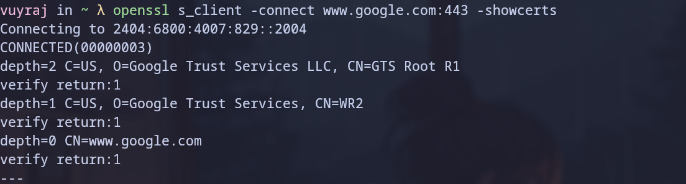
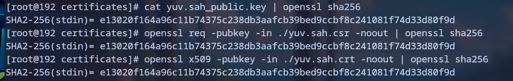
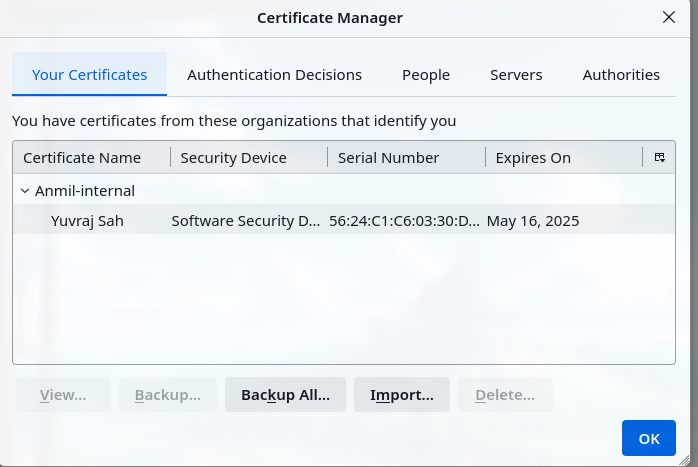
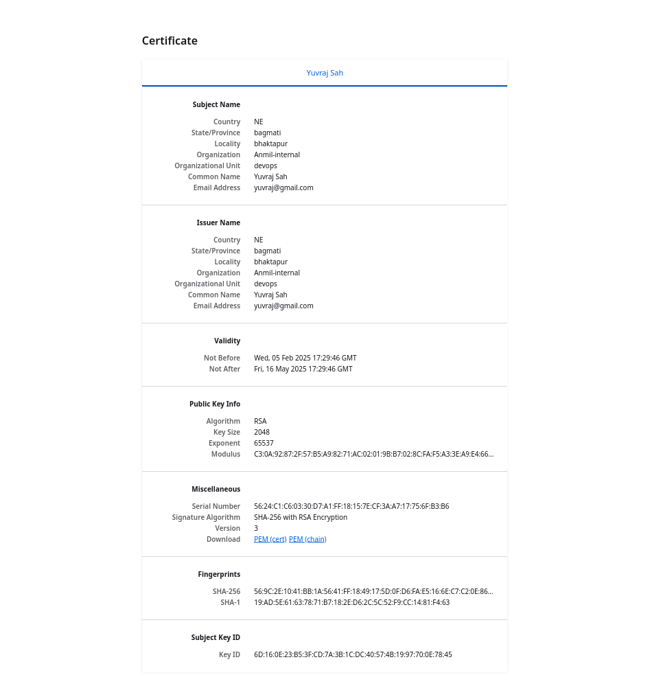
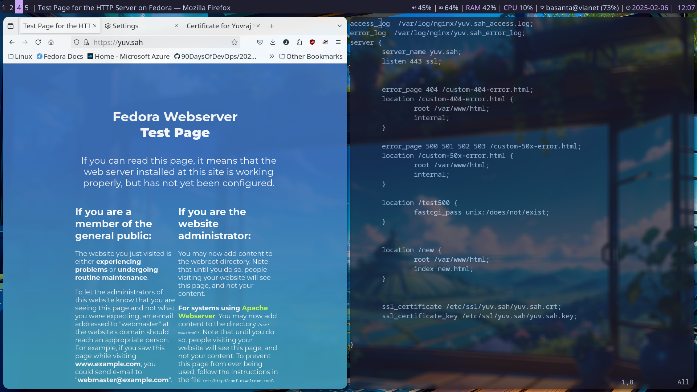
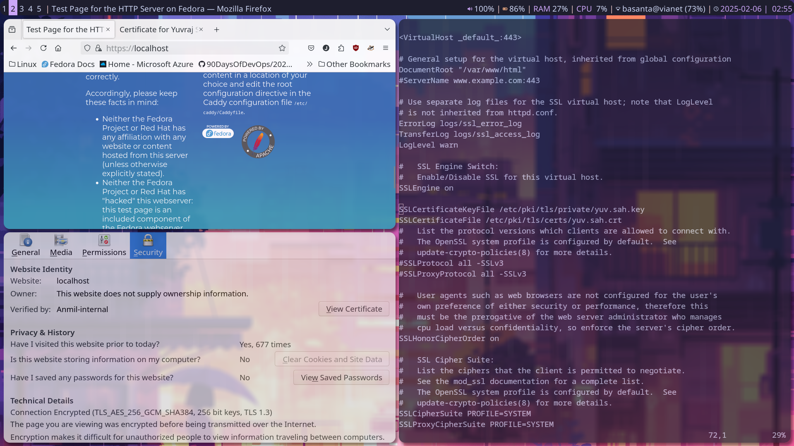
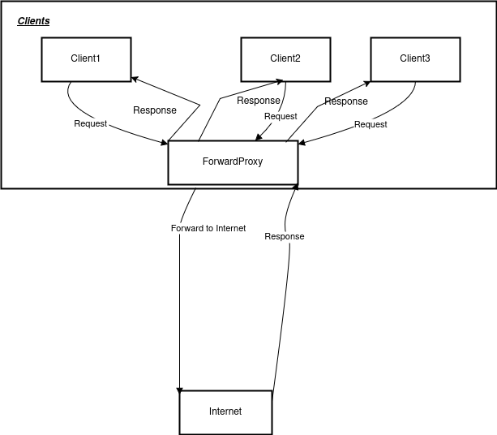
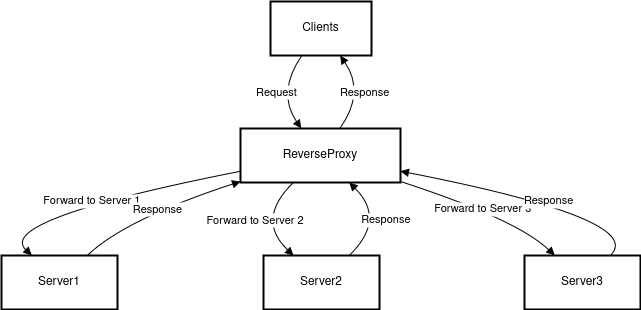
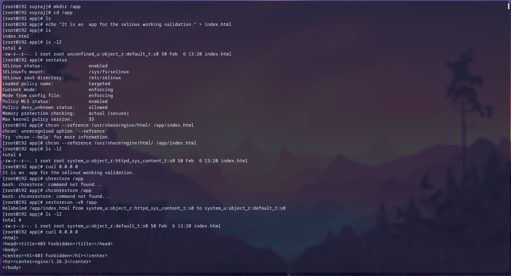
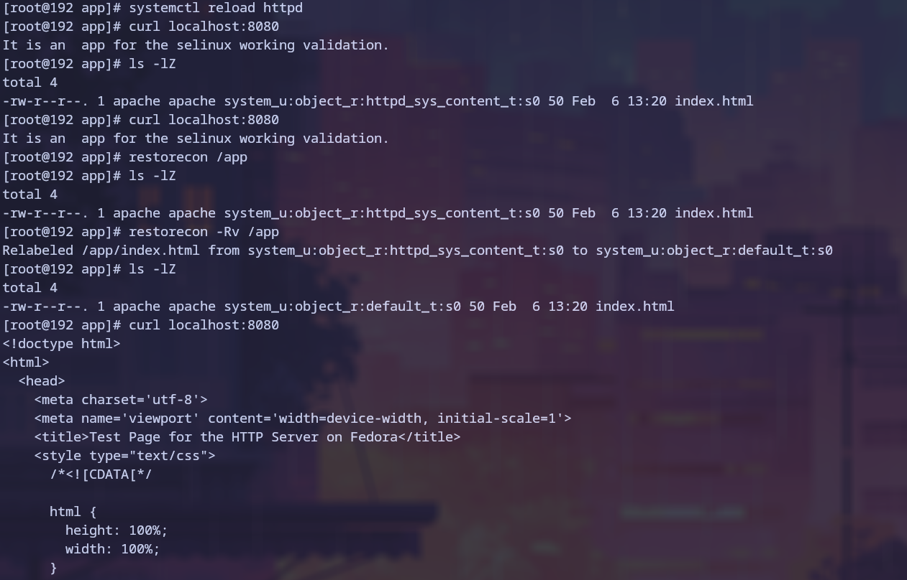

### OpenSSL

- OpenSSL is an open-source cryptographic library that provides secure communication over networks using the SSL and TLS protocols. 
- It allows us to generate certificates, encrypt/decrypt data, and establish secure connections.  
- It is widely used by the internet servers, including  majority of https websites.

### Basic Openssl commands

- `openssl version -a` to get details about the openssl installed in host.
- To create a private key `openssl genpkey -algorithm RSA -out server.key` , we can adjust the algorithm to different cryptographic algs. like edsa, rsa,etc
- To create a private key using rsa `openssl genrsa -des3 -out domain.key 2048` .If we want our key to be unecrypted we can remove `-des3` and last 2048 is an number of bits for the key. 

- To create csr from a private key `openssl req -new -key server.key -out server.csr`

- A single command to create both the private key and CSR `openssl req -newkey rsa:2048 -keyout domain.key -out domain.csr`

- We can sign our certificates ourselves with our own private key. 
- These  types of certificates are used in internal networks of the organization.
-  To create the self signed certificate `openssl x509 -signkey domain.key -in domain.csr -req -days 365 -out domain.crt`
- To create certificate from the private key only `openssl req -key domain.key -new -x509 -days 365 -out domain.crt` . The command will create a temporary csr.
- To create certificate , privatekey in single command `openssl req -newkey rsa:2048 -keyout domain.key -x509 -days 365 -out domain.crt`

- To view certificates in plain text `openssl x509 -text -noout -in domain.crt`
- To convert certificate from pem to pkcs12 `openssl pkcs12 -inkey domain.key -in domain.crt -export -out domain.pfx` . This extension is used in microsoft IIS for exporting and importing certificate chains.
-  To convert from pem to der `openssl x509 -in domain.crt -outform der -out domain.der`. It usually used in java.

### SSL Chaining

- A list of certificates from the root certificate , intermediatory certificates and at last the server certificate in a single certificate file.
- Root certificate are issued by the CA and the Ca only validates the root certificate.
- The intermediatory certificate are validated by Root cert and it is used to validate the server certificate.
- The server certificate are leaf nodes which is used to validate our server.
- The ssl chainig is like an tree where there is only one root cert and multiple other certs.
- In ssl chaining there must be at least 3 cetificates.
- The root certs are generally embedded at the browser, so they are trusted by the browser.
- The server certificate must appear before the chained certificates in the combined file.

- Example
- 
- From the above diagram we can see the certificate chains of google.com.
- At depth 2 , it shows that the certificate `CN= GTS ROOT r1` is root certificate and its verify return is 1 which means it is valid.
- At depth 1, it shows that the certificate `CN= WR2` is intermediate certificate and its verify return is 1 which means it is valid.
- At depth  , it shows that the certificate `CN= www.google.com is server certificate and its verify return is 1 which means it is valid.

- From above we can see that the certificate validation is done from server  to root crts.
- When clients tries to establish connection, server sends it server certificate and intermediate certificate. The client validates the intermediate and server certificate with the root CA's certificate which was already stored in the browser. 

### CSR

- A csr is a certificate signing request for the certificate authority to sign our sever's certificate.
- In the case of self signinig we can use  `openssl req -new -key private.key -out certificate.csr` command. 
- The CSR includes the public key and some additional information (such as organization and country).
- some of the details wiil be prompoted for you to input , thy are :
		-  Country Name 
		-  State or Province Name
		-  Locality Name
		-  Organization Name 
		-  Organizational Unit Name 
		-  Common Name 
		-  Email Address

### run apache and nginx servers separately with ssl

- At first we create a private key `yuv.sah.key` with its help we can create its pulic key as well.
- Then from the private key we will create the csr file `yuv.sah.csr`
- The from the csr we will create our certificate.
- The certificate is checked if it is for the same by follwing hashing method. If the hashing are same the they are from the same source.

- Then we convert the certificate and key to pkcs12 i.e. .pfx extension. 
- Then we can import the certificate in our browser by importing the yuv.sah.pfx file.

- After this we can view our websites in the browser. 
- Below is an certificate :

- After the certificate is installed , browser will still give an warning as the certificate is self signed. 
- For not receiving or suppressing the warnings we can ignore the site in the settings.

- ssl using nginx :-  

- ssl using httpd :-  

### working of ssl

When we visit a website with SSL enabled, our browser requests a secure connection from the web server. The server responds by sending its public key certificate to authenticate itself. Our browser then generates a random session key  with the public key to encrypt data before sending it over the network. This encrypted data can only be decrypted by the web server using its private key.
##### SSL Handshake  
It is  process that establishes a secure connection between the client and server.  
1) Client sends a request, specifying supported SSL/TLS versions and cipher suites.  
2) Server responds with its SSL certificate and selected encryption method.  
3) Through certificate Validation it validates if the server could be trusted or not.If trusted then , the client generates a session key and encrypts it with the server’s public key.  
4) Both sides agree on encryption, and secure communication begins.  

##### Certificate Validation 
It ensures that an SSL certificate is authentic and trusted.  The browser verifies:  
- The certificate is issued by a trusted Certificate Authority (CA).  
- The domain name matches the certificate.  
- The certificate hasn’t expired or been revoked.

### forward vs reverse proxy

- Forward proxy is the proxy server used by clients and those proxy server access the server providing the services. It provides clients the security and enhances the policy enforcement in the internal network. It is the proxy of clients side.

- Reverse Proxy is the proxy server used by the servers to protect themselves from the malicious users / clients. The reverse proxy appears as the simple server to the user. It routes the traffic of the clients and helps in load-balancing. It is the proxy of server side.

### host a webpage in a directory /app by managing selinux context

- The below image shows the selinux context for nginx

-  The below image shows the selinux context for httpd. Here in this exaple when the server could not access the file due to selinux , the server displays the default page.

