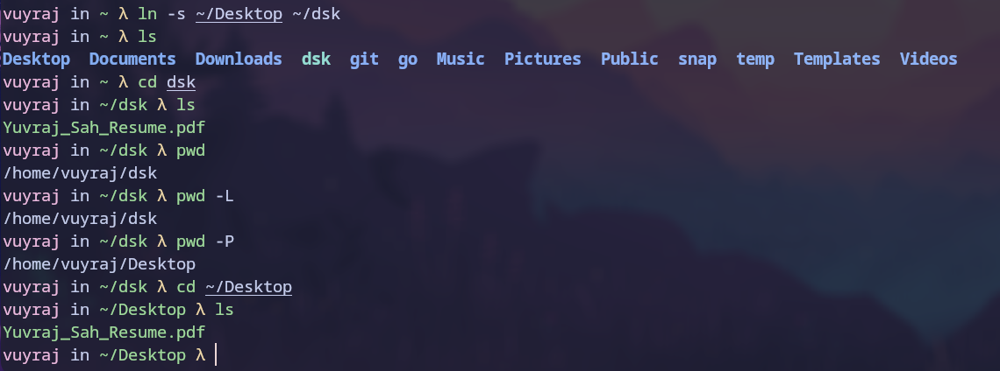
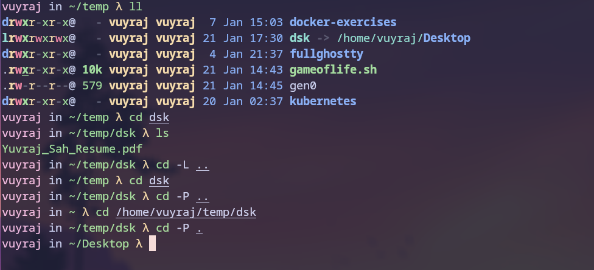
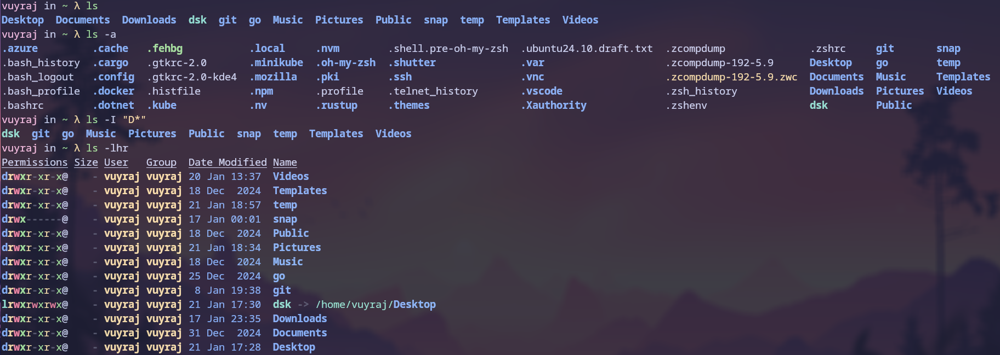
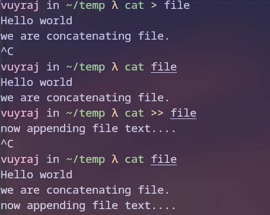
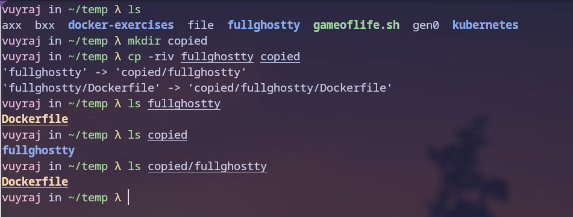
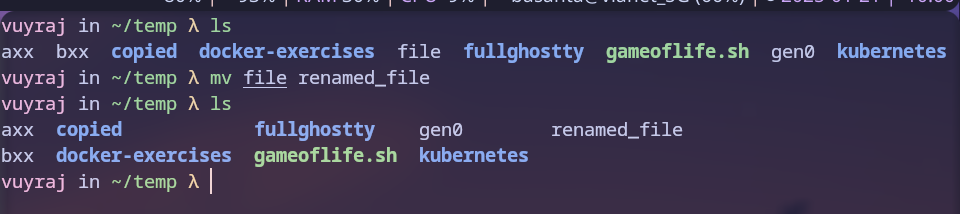
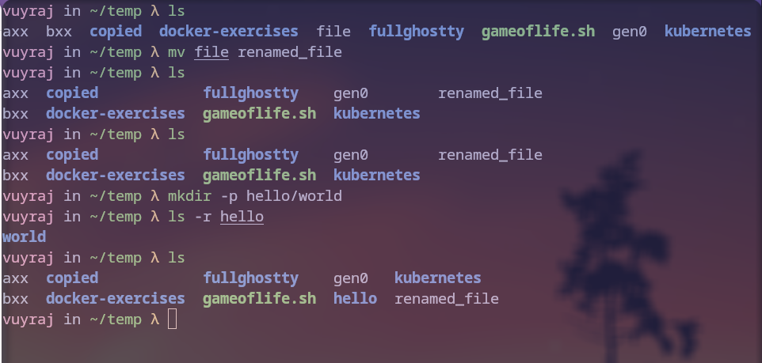
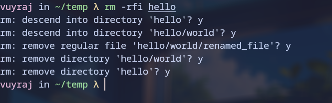

Some of the useful and basic linux cli commands are given below :-

### PWD

This command is used to print  the current working directory.
	flags :
		- L    =>  Prints the absolute physical path 
		- P    => Prints the absolute path with resolved symlnk
		

### Cd

This command is used for changing the Directory.
	flags :
		-  L  => without resolving links
		- P   => after resolving links
	
	1. cd / => goto root directory
	2. cd   => goto home directory
	3. cd .. => goto parent directory
	4. cd .  => goto current directory
	5. cd - => goto previous directory 

There is a new smarter cd command named zoxide for changing directories written in rust. It keeps track of the directories we use most frequently, and uses a ranking algorithm to navigate to the best match.

### Ls 

This command is used for listing directory contents. It list alphabetically and vertically.
		flags :
				- a => all contents including hidden one
				- I  => in long format , horizontally
				- s => show by size
				- I => ignore pattern 
				- r => sort in reverse
				- t => sort by time
				- h => human readable
				- d => only diirectories
I was using eza for listing which a new tool for listing and it gives a nice color format as well as other features.

### Cat

This command is used to print and concatenate file.
	Examples:
		- Print the contents of a file to stdout:
			`cat path/to/file`
		- Concatenate several files into an output file:
		    `cat path/to/file1 path/to/file2 ... > path/to/output_file
		- Append several files to an output file:
			 `cat path/to/file1 path/to/file2 ... >> path/to/output_file
		- Write stdin to a file:
		    cat - > path/to/file
		-  [n]umber all output lines:
			 `cat -n path/to/file

### Cp 
This command is used to copy files and directories.
	flags:
		- r => copy recursively
		- i => copy interactively
		- v => in verbose mode
		- t => multiple file at once
		- --parents => create any missing intermediate directories.

### Mv 
This command is used to move or rename files or directories
	flags:
		-- force => forcefully move the file
		-- interactive => ask for confirmation before overwriting the files.

### Mkdir
This command is used to make a directory. It can be used to set permissions while creatinf the directory.
	flags:
		-p => Create parents directory if needed
		-m => Create directories with specific permissions
		

### Rm 
This command is used to remove files or directories (rmdir). 
	flags:
		- r => delete recursively
		- f =>  delete forcefully
		- i => delete interactively
		- v => Verbose

### Touch
This command is used to create files and can also set access/modification times.

### Locate
This command is used to find the filenames. It looks for the pattern in database
	flags :
		- i => ignore case-sensitivity
		- l => sets limit 
		- c => print the total number of match found

### Find
This command is used to find files or directories under a directory tree, recursively.

### Grep
This command is used to find patterns in files or texts using regular expressions.
	flags:
		- F => disable regular expression search
		- r => search recursively
		- o => print for only matching
		- v => print inverted match (lines that do not match a pattern)

### Sudo
This command is used to run a single command as the superuser. 

### SSH
This command known as Secure Shell is a protocol used to securely log onto remote systems. It can be used for logging or executing commands on a remote server. It uses the remote servers ip address or domain and the username to log into the server as the provided username. Use `-p ` for connecting to a specific port of server. 

### Df 
This command is used to display an overview of the filesystem disk space usage.
	flags:
		- h => human readable
		
### Du
This command is used to see the file and directories space usage.
	flags:
		- h => in human readable form
		- b|k|m => show size in unit of (B/KiB/MiB)
		- a => all files or directories
		- c => show cumulative total at the end
		
Instead Use Dust another tool which gives a graphical view in comand line.
		
### Free
This command is used to display amount of free and used memory in the system.
	flags: 
		- h => human readable
		- b|k|m|g => in the provided unit
		- s => at every provided second refresh the output.
	
### Head
This command outputs the first part of the files.
	flags: 
		- n | --lines => Output the first few lines of file. with `-` sign at the number we can view everything but last lines
		- --bytes => Output the first few bytes of a file.
		
### Tail
This command outputs the last part of the files.
	flags: 
		- n | --lines => Output the last few lines of file. 
				with `+` sign at the number we can view everything from that line number.

### Diff
This command is used to compare the files and directories.
	flags :
		- w => ignore all the space
		- y => compare side by side
		- r => compare directories recursively and only show which files are different.

### Tar
This is an archiving utility. It combines multiples file in a single file . Which is often combined with compression method such as gzip / bzip2 .
	flags:
		- c => Create / Compress
		- z => gzipped
		- f => file
		- x => Extract
		- t => list
		- v => Verbose
		- a => automatically determine compression program
		
### Zip 
This command package es and compresses (archive) files into a Zip archive.

### Chmod
This command changes the access permissions of a file or directory.
	args:
		- u => user to which permission change is applicable
		- o => others
		- g => groups to which permission change is applicable
		- + => gives rights/ permissions
		-  - => remove rights/ permissions]
		- r => read file permission
		- w => write file permission
		- x => execute file permission

### Chown/chgrp 
They are used to manage ownership for a file and directory for users and groups. `-R ` is used to change the ownership of the whole directory and its content.

### Ping 
This command is used to check connectivity to a network by sending the a packets to the network hosts.
	flags: 
		- c => specific no. of times send packets
		- i => defines interval for sending packets
		- w => define timeout for each reply
### Uname 
Uname prints information about the machine and operating system it is run on.
	flags:
		- all
		- kernel-name
		- kernel-version
		- kernel-release
		- machine
		- processor
		- operating-system

### History 
This command line tool is used to view recently used commands. It display the commands history list with line numbers.
	flags:
		-c => clear the history for running shell session
		-w => Overwrite history file with current bash shell
	examples:
		- `!!` => subsitute with the previous command
		- `![0-9]*` =>  substitute with a command based on its line number found with history.
		-   `![a-Z ]*`Substitute with the most recent command that starts with a string.
### Man
This is used to format and display manual pages of a specific command.

### Top
This command displays dynamic real-time information about running processes.
we can use its alternatives like htop, btop, etc.
### Jobs
This is a Shell built-in command for viewing information about processes spawned by the current shell.
	flags:
		- l => List jobs and their process IDs
		- p => Display only process IDs
### Kill
This command is used to send a signal to a process to kill that particular process which might be unresponsive and unwanted.
Process id of the procee is usually given to the comand.

### Echo 
It is used to Print given arguments. It can also be used to append a message to the file using `>>` or overwrite using `>` . It can be used to interpret the varibales as well by prefixing $ to the variable.
	flags : 
		- e => Enable interpretation of backslash escapes (special characters)
		- n => Print a message without the trailing newline.
	`echo $? => Print the exit status of the last executed command`
### Systemctl 
This a powerful command line utility which is used to control the systemd system and service manager.
	args:
		- status
		- start|stop|restart|reload|status
		- enable|disable
		- daemon-reload
		- is-active|is-enabled|is-failed unit
- 
### useradd/userdel
These are used to create or delete users in linux system. Usually they are superuser command.

### Hostname
This command is used to show or set the system's host name.
	flags :
		- i => show the network address of the host
		- fqdn => shows the Fully Qualified Domain Name

### Wget
This command is wsed to download files from the Web with the hlep of its URL. It supports HTTP, HTTPS, and FTP.

### IP
This command is used to show/manipulate routing, devices, policy routing and tunnels.
	args:
		- address => List interfaces 
		- link => List interfaces with brief link layer info:
		- route => Display the routing table
		- neighbour =>  Show neighbors (ARP table)
### scp/rsync
It is used to copy/ transfer files  between hosts over SSH.

SCP is Secure Copy. It copies files between hosts using Secure Copy Protocol over SSH. scp is more secure than rsync.

Rsync transfer files either to or from a remote host by default using SSH. It is better than scp in performance and interrupt handling.
Rsync is a fast file copying tool.

